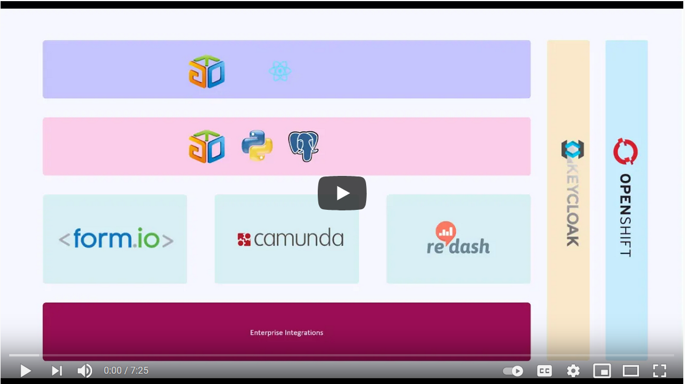
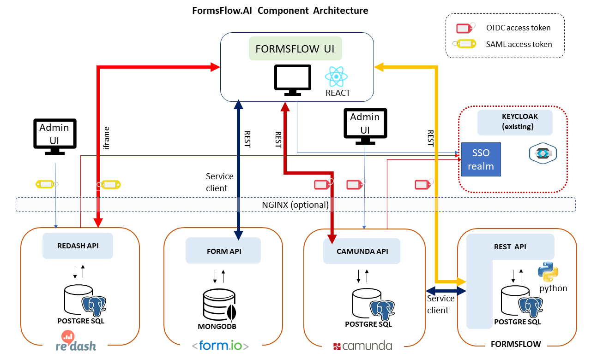

 
 

**formsflow.ai**   is an open source solution framework developed and maintained by [AOT Technologies](https://www.aot-technologies.com/). The framework combines selected open source Forms, Workflow, Analytics, and Security products with custom-built integration code to provide a seamless solution that provides a viable alternative to expensive, enterprise software products.

## Table of Contents

1. [Introduction](#introduction)
2. [About the Project](#about-the-project)
    * [Features](#features)
3. [Download and Installation](#download-and-installation)
4. [Project Tree](#project-tree)
5. [System Architecture](#system-architecture)
6. [Security Instructions](#security-instructions)
7. [System Operation](#system-operation)
    * [Managing Forms](#managing-forms)
    * [Managing Workflows](#managing-workflows)
    * [Managing Analytics Dashboard](#managing-analytics-dashboard)
8. [Quick Start](#quick-start)
9. [License](#license)
10. [Links](#links)

## Introduction

> A brief introduction about formsflow.ai is given below.

## About the Project

The project was initiated by [AOT Technologies](https://www.aot-technologies.com/) as a means of addressing the general situation whereby end-users fill in a form, the form is processed and there may be a requirement to report on the form metrics or data.

Typical use cases are:

* Applications for licenses
* Public submissions
* FOI requests
* Applications for funding
* Statements of compliance
* Employee onboarding
* Performance Reviews
* Emergency processes
* Escalations
* Surveys
* Case Management

### Features

* Drag-and-drop forms-builder with rich UI components
* Lightweight server-based workflow engine with full capabilities including human, parallel, asynchronous and timed flows, decision engine, and graphical designer
* Notifications engine for notifications, reminders, and alerts on tasks and even data thresholds.
* Metrics and data visualization dashboards for the display of key workflow and form data
* (future) Multi-tenancy isolation
* Containerized deployment with docker, docker-compose, and Openshift
* Flexible Identity Management uses existing IDM systems for authentication and single sign-on

## Download and Installation

- If you want to download and setup, follow the [installation guide](./deployment), you will find step-by-step instructions to download and install.
- For Docker based single click installation follow the instruction from [here](https://github.com/AOT-Technologies/forms-flow-ai-deployment/blob/main/README.md)

### Project Tree

* [deployment](./deployment) Deployment of complete framework
  * [docker](./deployment/docker) Deployment using docker
  * [nginx](./deployment/nginx) Deployment on a remote host using nginx
  * [Openshift](./deployment/openshift) Deployment using openshift platform
* [forms-flow-idm](./forms-flow-idm) Identity Management (Keycloak)
* [forms-flow-forms](./forms-flow-forms) form.io deployment and  integration
* [forms-flow-bpm](./forms-flow-bpm) Camunda Workflow deployment and integration
* [forms-flow-web](./forms-flow-web) formsflow.ai integration web UI
* [forms-flow-api](./forms-flow-api) REST API to formsflow.ai integration components
* [forms-flow-analytics](./forms-flow-analytics) Redash analytics components

## System Architecture

## Components

The components of the system are:

#### formsflow UI

Browser-based React integration web UI
Most of the day-to-day end-user and review tasks are performed from this application,  built specifically to act as a common UI combining forms, workflow, and analytics functionality. The web application is written as a [progressive](https://en.wikipedia.org/wiki/Progressive_web_application) app with the potential for offline data-entry. formsflow UI accesses the individual system component data through native API's using OIDC or SAML access tokens.

#### formsflow UI Extension for Vue.js (optional)

There is a Vue.js based web user interface for easy integration of formsflow.ai to your existing User Interface. This extension provides components
for easily using Forms, Tasklist by installing as a npm package. To know more details checkout [formsflow-ai-extension repository](https://github.com/AOT-Technologies/forms-flow-ai-extensions/tree/master/camunda-formio-tasklist-vue) and to install package [go here](https://www.npmjs.com/package/camunda-formio-tasklist-vue).

#### Redash Admin UI

The native admin interface to Redash (bundled and unchanged). Use this to build analytics dashboards.

#### Redash API

The REST interface to the Redash core. Bundled and unchanged

#### Form.io API

The REST interface to the form.io core

#### Camunda Admin UI

The native admin interface to Camunda (bundled and unchanged) . Use this to define workflows and to manage workflow tasks as an admin.

#### REST API

Python REST API providing business logic around the internal formsflow.ai Postgres database. This API is used extensively by the formsflow.ai UI to synchronize, maintain state, extend functionality, and integrate between components.

#### Nginx Web server (optional)

Webserver providing reverse-proxy redirection and SSL to components for remote deployments. ( bundled and configured )

#### Keycloak Identity management server

The system uses an existing (your) Keycloak server which provides a common identity management capability. The system provides default installation and provisioning of the Keycloak server for local setup, steps are mentioned [here](./forms-flow-idm/keycloak/README.md#local-keycloak-setup).
However, you can setup your own Keycloak server and follow the provisioning steps [here](./forms-flow-idm/keycloak/README.md#server-keycloak-setup).

## Security Instructions

To secure formsflow.ai and understand authorization roles follow the documentation on [Security Setup](./forms-flow-idm ).

## System Operation

In general, the operation is as follows :

**Note** The URL links assume a local installation on the default ports as per the [installation instructions](./deployment ):

#### Client

* End-user logs into formsflow.ai UI at URL- <http://localhost:3000/>
* User is redirected to Keycloak via OIDC where user's roles are returned as OIDC claims in a JWT
* User selects a form from the list of forms available. The available forms can be filtered by the user group with advanced configuration, by default the user sees all forms published. Form details are provided through form.io
* The user fills in the form and submits it
* The form data is added to the Mongo DB. Details of the transaction are added to the Postgress DB
* A task is created on the Camunda server corresponding to the form type
* Notifications are sent to reviewers associated with that task type

#### Reviewer

* Reviewer logs into formsflow.ai UI at URL- <http://localhost:3000/>
* Reviewer is redirected to Keycloak via OIDC where the user's roles are returned as OIDC claims in a JWT. The fact that the reviewer has a reviewer role from Keycloak enables additional capabilities in the UI.
* Reviewer accesses task from task list. Tasks are retrieved through the Camunda API, filtered by the reviewer group memberships mapped between Keycloak and native Camunda.
* Reviewer claims a task and processes it. The task moves to the next step in the workflow, with appropriate notifications and actions specific to that workflow.
* Reviewer can access forms from the forms list, filtered by the group permissions of the user groups as per advanced configuration.
* Reviewer can access metrics data from the Postgres database filtered according to the configuration. formsflow.ai UI renders these metrics into usable pages.
* Reviewer can access Redash analytics dashboards (as iframes).

#### Designer

These users are responsible for accessing the native capabilities of the embedded products to configure analytics dashboards, create and manage workflows, and create and manage forms. It is beyond the scope of this document to describe the detailed functionality of these products, however, the general process is :

* Access product URL as follows:
  * forms-flow-bpm: <http://localhost:8000/camunda/>
  * forms-flow-forms: <http://localhost:3001/> (the form designer is embedded into the formsflow.ai UI)
  * forms-flow-analytics: <http://localhost:7000/>
* The login process is the same for all of them except for forms-flow-forms where separate credentials can be configured, redirect to Keycloak as OIDC (SAML for Redash), and obtain the appropriate JWT + claims.
* For the forms designer, the FormFlow UI recognizes the additional role of forms-flow-designer and enables a form design capability
* For Redash and Camunda, there is a mapping in the configuration file which needs to be setup between forms-flow-analytics and forms-flow-bpm and the corresponding groups in Redash and Camunda respectively. This is all covered in the installation instructions.

### Managing Forms

* Login to **<http://localhost:3000/>** using valid **[designer](./forms-flow-idm/keycloak/README.md#health-check)** credentials
* Navigate to menu **Forms**
* Click the button **+ Create Form** to launch the form designer studio.
* Design the form using **Drag and Drop** of components from LHS to RHS and publish by clicking the button **Create Form**.

To know more about form.io, [go to](https://help.form.io/userguide/introduction/).

### Managing Workflows

* You would need the [Camunda Modeler to design your BPMN:](https://camunda.com/download/modeler/)
* To learn about [designing your BPMN, go to:](https://docs.camunda.org/get-started/quick-start/service-task/)
* To learn about [deploying your BPMN, go to:](https://docs.camunda.org/get-started/quick-start/deploy/). Note that your [default endpoint for Camunda's REST API is](http://localhost:8000/camunda/engine-rest).

### Managing Analytics Dashboard

* Login to **<http://localhost:7000/>** using valid **admin** credentials
* Create the dashboard by following the Redash [userguide](https://redash.io/help/user-guide/getting-started).

## Quick Start

 We recommend you visit [Web site](https://formsflow.ai/) and read the "Getting Started" page.

## License

Copyright 2020 AppsOnTime-Technologies 2020

Licensed under the Apache License, Version 2.0 (the "License");
you may not use this file except in compliance with the License.
You may obtain a copy of the License at

    http://www.apache.org/licenses/LICENSE-2.0

Unless required by applicable law or agreed to in writing, software
distributed under the License is distributed on an "AS IS" BASIS,
WITHOUT WARRANTIES OR CONDITIONS OF ANY KIND, either express or implied.
See the License for the specific language governing permissions and
limitations under the License.

## Links

* [Web site](https://formsflow.ai/)
* [Source code](https://github.com/AOT-Technologies/forms-flow-ai)
