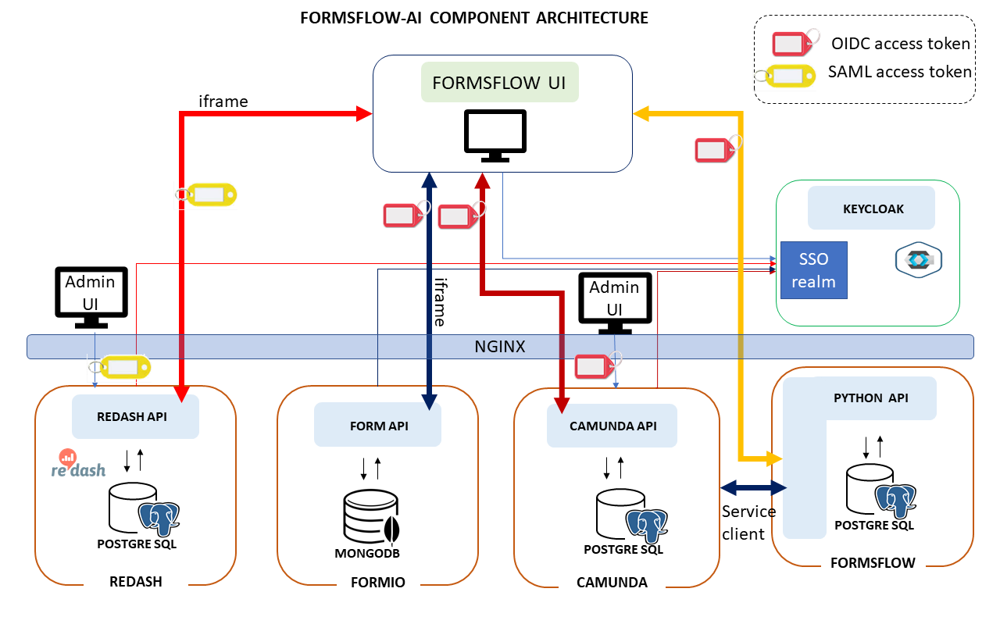

# FormsFlow.AI
`FormsFlow.AI` is an open source solution framework developed and maintained by [AOT Technologies](https://www.aot-technologies.com/). The framework combines selected  open source Forms, Workflow, Analytics and Security products with custom-built integration code to provide a seamless solution which provides a viable alternative to expensive, enterprise software products.

## Table of contents
* [About the Project](#about-the-project)
  * [Project dependencies](#project-dependencies)
  * [Project tree](#project-tree)
* [Features](#features)
* [System Architecture](#system-architecture)
* [User and roles](#users-and-roles)
* [System Operation](#system-operation)
* [Installation and Configuration](#installation-and-configuration)
* [Installation and Configuration](#installation-and-configuration)
  * [Prerequisites](#prerequisites)
  * [Build](#build)
  * [Default Settings](#default-settings)
  * [Environment Variables](#Environment-Variables-setup)
  * [Running the application in Docker Environment](#running-the-application-in-docker-environment)
* [Managing forms](#  -forms)
* [Additional Configurations](#additional-configurations)
    * [SSL Nginx configurations](#ssl-nginx-configurations)
* [License](#license)
* [Links](#links)

## About the Project
The project was initiated by AOT Technologies as a means of addressing the general situation whereby end-users fill in a form, the form is processed and there may be a requirement to report on the form metrics or data. Typical use cases are :

* Applications for licences
* Public submissions
* FOI requests
* Applications for funding
* Statements of compliance
* Employee onboarding
* Performance Reviews
* Emergency processes
* Escalations
* Surveys
* Case Management

### Project Dependencies


- [form.io](https://www.form.io/opensource) (included under forms-flow-ai/forms-flow-forms)
- [Camunda](https://camunda.com/) (included under forms-flow-ai/forms-flow-bpm)
- [Keycloak](https://www.keycloak.org/) (existing Keycloak server required)
- [Redash](https://redash.io)(included under forms-flow-ai/forms-flow-analytics)
- [Python]() (included under forms-flow-ai/forms-flow-webapi)
- [Nginx](https://www.nginx.com)(included under forms-flow-ai/nginx)

### Project tree

. * [README.md](./README.md) This file
 * [forms-flow-analytics](./forms-flow-analytics) ReDash analytics components
   * [README](./forms-flow-analytics/README)
 * [forms-flow-bpm](./forms-flow-bpm) Camunda Workflow deployment and integration
    * [README](./forms-flow-bpm/README)
* [forms-flow-db](./forms-flow-db) Database scripts
   * [README](./forms-flow-db/README)
 * [forms-flow-forms](./forms-flow-forms) form. io deployment and  integration
   * [README](./forms-flow-forms/README)
 * [forms-flow-idm](./forms-flow-idm) Identity Management (Keycloak)
   * [README](./forms-flow-idm/README)
 * [forms-flow-web](./forms-flow-web) React Integration client
   * [README](./forms-flow-web/README)
 * [mongodb](./mongodb) Mongodb database for form.io integration
   * [README](./mongodb/README)
 * [openshift](./openshift)  Openshift deploynent
   * [README](./openshift/README)
 * [postgres](./postgres) Postgres database for BPM integration
   * [README](./postgres/README)
* [nginx](./nginx) nginx front-end web server
   * [README](./nginx/README)


Features 
------------------
- Ease-of-use: Drag drop and build forms using designer studio interface
- Lightweight Workflow Engine: Support for both (micro-)service orchestration and human task management
- Business Driven Decision Engine: Pre-integrated with the workflow engine, and also can be used as a stand-alone via REST 
- Notifications: Custom built components sends information about new submissions, reminders on nearing SLAs and followups. 
- Escalation and Alerts Management: Customizable escalation strategy of sending notifications, re-assigning the tasks and alerts on thresholds 
- Visualization and dashboards: Create beautiful visualizations with drag and drop
- Multi-tenancy isolation.
- Get up and running quickly with prebuilt Forms, workflows and dashboards.
- User your Keycloak-server for authentication


## System Architecture

See diagram 


### Components 

The components of the system are :
#### Formsflow UI
Browser-based React web-app (this project)
Most of the day-to-day end-user and review tasks are performed from this application,  built specifically to act as a common UI combining forms, workflow and analytics functionality. The web-application is written as a [progressive](https://en.wikipedia.org/wiki/Progressive_web_application) app with potential for offline data-entry. FormsFlow UI accesses the individual system component data through native API's using OIDC or SAML access tokens.

#### Redash Admin UI
The native admin interface to ReDash (bundled and unchanged). Use this to build analytics dashboards.
#### Redash API
The REST interface to the Redash core. Bundled and unchanged
#### Form.io admin UI
The native admin interface to form.io (bundled and unchanged ). This is also iframed into the Formsflow UI to allow design of forms without leaving the main application.
#### Form.io API
The REST interface to the form.io core
#### Camunda admin UI
The native admin interface to Camunda (bundled and unchannged) . Use this to define workflows and to manage workflow tasks as an admin.
#### Python API
API providing business logic around Formsflow Postgres DB (this project). This API is used extensiveoy by the FormsFlow UI synchronise/maintain state/extend functionality/integrate .
#### Nginx Web server
Webserver providing reverse-proxy redirection and to components. ( bundled and configured ) 
Keycloak Identity management server - Your Keycloak server. Set up Realms, Users, Groups, Service accounts, Mappings.(Not provided)

#### Keycloak
The system  has at its core a Keycloak server which provides a common identity management function. Provisioning of the Keycloak server is not part of this project, however there are specific [Keycloak configuration tasks](./forms-flow-idm/README) which are required for this project. 
### FormsFlow UI

## Users and Roles

The framework defines user roles which are standardised across all the products. During the installation process, component-specific variants of these roles are set up , these need to be added to the main .env file in order to provide seamless integration

- formsflow-designer  

  * Design and manage electronic forms
- formsflow-bpm
  * Create workflows and associate forms with deployed workflows
- formsflow-analyst
  * Create metrics and analytics dashboards. 
- formsflow-reviewer (Staff)
  * Receive and process online submissions. 
  * Fill in forms on behalf of the client if needed. 
  * View reports on analytics (slice 'n dice the data within the form) and metrics (details about the process eg. how many cases processed per day  )
- formsflow-client 
  * Fill in and submit online form(s)


  A user may be assigned multiple roles. This is done in Keycloak by the Keycloak administrator. 

  For example it is possible to assign a user to roles formsflow-analyst and formsflow-reviewer, which would allow the user to not only process forms but also design analytics dashboards. 


## System Operation

In general operation is as follows (assuming local installation ):

#### End-user
* End-user logs into FormsFlow UI at url https://localhost/formsflow-ui
* User is redirected to Keycloak via OIDC where user's roles are returned as OIDC claims in a JWT
* User selects a form from the list of forms available. The available forms can be filtered by the user group with advanced configuration, by default the user sees all forms published. Form details are provided through form.io 
* The user fills in the form and submits it
* The form data is added to the Mongo DB. Details of the transaction are added to the Postgress DB
* A task is created on the Camunda server corresponding to the form type
* Notifications are sent to reviewers associated with that task type

#### Reviewer

* Reviewer logs into FormsFlow UI at url https://localhost/formsflow-ui
* Reviewer is redirected to Keycloak via OIDC where user's roles are returned as OIDC claims in a JWT. The fact that the reviewer has a reviewer role from Keycloak enables additional capabilities in the UI.
* Reviewer accesses task from task list. Tasks are retrieved through the Camunda API, filtered by the reviewer group memberships mapped between Keycloak and native Camunda. 
* Reviewer claims a task and processes it. The task moves to the next step in the workflow, with appropriate notifications and actions specific to that workflow.
* Reviewer  has the capability to access forms from the forms list, filtered by the group permissions of the user groups as per advanced configuration.
* Reviewer  has the ability to access metrics data from Postgres database filtered according to the configuration. FormsFLow UI renders these metrics into usable pages. 
* Reviewer has the ability to access Redash analytics dashboards (as iframes). Access to the Redash dashboards and the configuration for them is covered in 

#### Designers / Administrators

These users are responsible for accessing the native capabilities of the embedded products in order to configure analytics dashboards, create and manage workflows and create and manage forms. It is beyond the scope of this document to describe the detailed functionality of these products, however the general process is :

* Access product URL as follows :
  * Camunda : https://localhost/camunda
  * form. io : https://localhost/formflow-ui (the form designer is embedded into the form flow UI as well)
  * Redash : https://localhost/analytics
* The login process is the same for all of them, redirect to Keycloak as OIDC (SAML for Redash) and optain the appropriate JWT + claims. 
* For the forms designer, the FormFlow UI recognises the additional role of formsflow-designer and enables a form design capability
* For Redash and Camunda, there is a mapping in the configuration file which needs to be setup between formsflow-analyst and formsflow-bpm and the corresponding groups in Redash and Camunda respectively.


## Installation and configuration
 The framework installs the products  mentioned above (with the exception of Keycloak which must either be pre-existing or installed and configured in advance).

The products are installed with a default configuration so that the base system works "out-the-box", however the advanced configuration and management of the products requires the relevant product documentation. 

### Prerequisites

* The system is deployed and run using [docker-compose](https://docker.com) and [docker](https://docker.com). These need to be available. 
* There needs to be a [Keycloak](https://www.keycloak.org/) server available and you need admin privileges (ability to create realms, users etc.).
* All components are installed by default onto a single server. Distribution across multiple servers would be possible but beyond the scope of this document
* This server  can be a local PC or Mac provided it is 64-bit with at least 16GB RAM and 100GB HDD

### Default settings

By default the following component settings are configured. These could be changed to other components if needed but it is beyound the scope of this document 
* postgres db is used for the Camunda server
* mongo db is used for the form.io server
* Keycloak is used as the identity management server. 

### Configure and Build

* Clone this github repo.
* In the project root folder copy the sample.env file to .env 
* Set up Keycloak as per the instructions under [Keycloak README](./forms-flow-idm/README), and plug the values derived from this into the.env file as per the table under  [Keycloak](#KEYCLOAK)
* Edit the remainder of the .env file according to the details contained in [Environment Variables Setup](#environment-variables-setup)
**NB:** Some of the values are derived post initial deployment. These are highlighted and must be added following a successful initial deployment, prior to redeployment. These values are typically client ID's generated by components at initialisation. 
* Start the system as per [Running the application](#running-the-application)

### Environment Variables Setup

The following sections describe environment variables grouped according to the component for which the environment variable provides configuration NOT according to the component using it. In this sense the environment variable naming might seem confusing as they were largely created and named according to the component USING them which was logical at the time, but has become superceded as more components require usage of the same component. 

Environment variable with no default value need to be defined (unless otherwise specified). In general those with a default value can be left as is depending on specific circumstances. 

#### General

Variable name | Meaning | Possible values | Default value |
--- | --- | --- | ---
`NODE_ENV` | define project level configuration | `development, test, production` | `development`
`APP_SECURITY_ORIGIN` | Set CORS Origin |Domains from which cross-site requests are allowed |`*`

#### Postgres Formsflow

Variable name | Meaning | Possible values | Default value |
--- | --- | --- | ---
`POSTGRES_USER`|Postgres Root Username|Used on installation to create the database.Choose your own |`postgres`
`POSTGRES_PASSWORD`|Postgres Root Password|ditto|`changeme`
`POSTGRES_DB`|Postgres Database Name|ditto|`postgres`


####  KEYCLOAK
Variable name | Meaning | Possible values | Default value |
--- | --- | --- | ---
`KEYCLOAK_URL`| URL to your keycloak server|eg. https://iam.aot-technologies.com| must be set to your keycloak server
`KEYCLOAK_URL_REALM`|The Keyvcloak realm to use| eg. form-test| must be set to your keycloak realm
`KEYCLOAK_CLIENTID`|Your Keycloak Client ID within the realm|eg. forms-flow-bpm | must be set to your keycloak client id
`KEYCLOAK_CLIENTSECRET`|The secret for your Keycloak Client Id| eg. 22ce6557-6b86-4cf4-ac3b-42338c7b1ac12 | must be set to yourkeycloak client secret
`REACT_APP_CLIENT_ROLE`|The role name used for client users||`formsflow-client`
`REACT_APP_STAFF_DESIGNER_ROLE`|The role name used for designer users||`formsflow-designer`
`REACT_APP_STAFF_REVIEWER_ROLE`|The role name used for reviewer users||`formsflow-reviewer`
`STAFF_ANALYST_ROLE`|The role name used for analyst/redash users||`formsflow-analyst`
`STAFF_BPM_ROLE`|The role name used for workflow designer users||`formsflow-bpm`
`REACT_APP_KEYCLOAK_CLIENT`|Keycloak client name for FormsFlowUI||forms-flow-web
`BPM_TOKEN_API`|Keycloak OIDC token API for clients|Plug in your keycloak base url and realm name|`<KEYCLOAK-BASE-URL>/auth/realms/<realm>/protocol/openid-connect/token`
`JWT_OIDC_WELL_KNOWN_CONFIG`|Path to Keycloak well-know config for realm|Plug in your keycloak URL plus realm|`<KEYCLOAK-BASE-URL>/auth/realms/<REALM>/.well-known/openid-configuration`
`JWT_OIDC_ALGORITHMS`|JWT signing algorithms||`RS256`
`JWT_OIDC_JWKS_URI`|Keycloak JWKS URI|Plug in Keycloakd base url plus realm| `<KEYCLOAK-BASE-URL>/auth/realms/<REALM>/protocol/openid-connect/certs`
`JWT_OIDC_ISSUER`| The issuer of JWT's from Keycloak for your realm| Plug in your realm and Keycloak base url | | `<KEYCLOAK-BASE-URL>/auth/realms/<REALM>`
`JWT_OIDC_AUDIENCE`|The audience for the JWT||`forms-flow-web`
`JWT_OIDC_CACHING_ENABLED`|JWT caching||`True`
`JWT_OIDC_JWKS_CACHE_TIMEOUT`| How long to cache JWKS values before rechecking server||`300`

####  form.io 
Variable name | Meaning | Possible values | Default value |
--- | --- | --- | ---
`ROOT_EMAIL`|form.io admin login |eg. user@gov.bc.ca | must be set to whatever email address you want form.io to have as admin user|
`ROOT_PASSWORD`|form.io admin password|eg. dontusethis|must be set to whatever password you want for your form.io admin user
`REACT_APP_API_SERVER_URL`|The URL of the form.io server ||`http://localhost:3001`
`REACT_APP_API_PROJECT_URL`|The URL of the form.io project server ||`http://localhost:3001`
`REACT_APP_CLIENT_ID`|form.io client role Id|eg. 10121d8f7fadb18402a4c|must get the value from form.io interface as per 
`REACT_APP_STAFF_REVIEWER_ID`|form.io reviewer role Id|eg. 5ee10121d8f7fa03b3402a4d| must get the value from form.io interface as per 
`REACT_APP_STAFF_DESIGNER_ID`|form.io administrator role Id|eg. 5ee090afee045f1597609cae|must get the value from form.io interface as per 
`REACT_APP_ANONYMOUS_ID`|form.io anonymous role Id|eg. 5ee090b0ee045f28ad609cb0|must get the value from form.io interface as per
`REACT_APP_USER_RESOURCE_FORM_ID`| User forms form-Id| eg.5ee090b0ee045f51c5609cb1| must get the value from form.io interface as per
`MONGO_INITDB_ROOT_USERNAME`|Mongo Root Username. Used on installation to create the database.Choose your own|Can be blank|
`MONGO_INITDB_ROOT_PASSWORD`|Mongo Root Password|Can be blank
`MONGO_INITDB_DATABASE`|Mongo Database Name||formio
`MONGO_REPLICA_SET_NAME`|Mongo Replica set name|| rs0

#### FormsFlow UI

Variable name | Meaning | Possible values | Default value |
--- | --- | --- | ---
 `REACT_APP_EMAIL_SUBMISSION_GROUP`|Group to to which to send Email notifications|Must match keycloak group| `formsflow-reviewer`

#### ReDash
Variable name | Meaning | Possible values | Default value |
--- | --- | --- | ---
`REACT_APP_INSIGHT_API_BASE`| Insight Api base end-point| eg. | 
`REACT_APP_INSIGHTS_API_KEY`| API_KEY from REDASH | | must insert your ReDash API key here

`JDBC_URL`|JDBC DB Connection URL for BPM-API||`jdbc:postgresql://forms-flow-bpm-db:5432/postgres`	
`JDBC_USER`|Username for BPM database user|||	
`JDBC_PASSWORD`|Password for BPM database user|||
`JDBC_DRIVER`|JDBC driver||`org.postgresql.Driver`
`BPM_CLIENT_ID`|Client ID for Camunda to register with Keycloak||`forms-flow-bpm`
`BPM_CLIENT_SECRET`|Secret returned from BPM client registration|Plug in your BPM secret key|`<BPM CLIENT SECRET KEY HERE>`
`BPM_GRANT_TYPE`|OIDC grant type||`client_credentials`
`BPM_API_BASE`| Base URL for accessing Camunda data||`http://localhost:8000/camunda/engine-rest/`
`API_PROCESS`|Path fragment to query process definition||`process-definition/`
`API_TASK_HISTORY`|Path fragment to query task history||`history/task/`
`API_TASK`|Path fragment for task API||`task/`


#### FormsFlow Python API 
Variable name | Meaning | Possible values | Default value |
--- | --- | --- | ---
`REACT_APP_WEB_BASE_URL`|Web API base endpoint|||
`WEB_API_DATABASE_URL`|URL used to access the web api| Fill in the user and password from below |`postgresql://<USER>:<PASSWORD>@forms-flow-webapi-db:5432/<WEBAPI_DB>`
`WEB_API_POSTGRES_USER`|FormsFlow database postgres user||postgres
`WEB_API_POSTGRES_PASSWORD`|FormsFlow database postgres password|Change this|`changeme`
`WEB_API_POSTGRES_DB`| FormsFlow database name||`formsflow`


SECRET_KEY='--- change me now ---'
## Running the Application
     -----------------------
* Open up your terminal and navigate to the root folder of this project
* Start the application using the command
            ```docker-compose up --build           ```
* The following applications will be started and can be accessed in your browser.
         - http://localhost:3000 - forms-flow-web
         - http://localhost:3001 - forms-flow-forms
         - https://localhost:8000/camunda - forms-flow-bpm
    
Managing forms
--------------
- Refer [forms-flow-web](https://github.com/AOT-Technologies/forms-flow-ai/tree/master/forms-flow-web#forms-flow-web)

Analytics-Redash
----------------
- Refer [forms-flow-analytics](https://github.com/AOT-Technologies/forms-flow-ai/tree/master/forms-flow-analytics#how-to-run)


  
## License

FormsFlow-AI is licensed under the terms of the GPL Open Source
license and is available for free.

## Links

* [Web site](https://www.aot-technologies.com/)
* [Source code](https://github.com/AOT-Technologies/forms-flow-ai)

