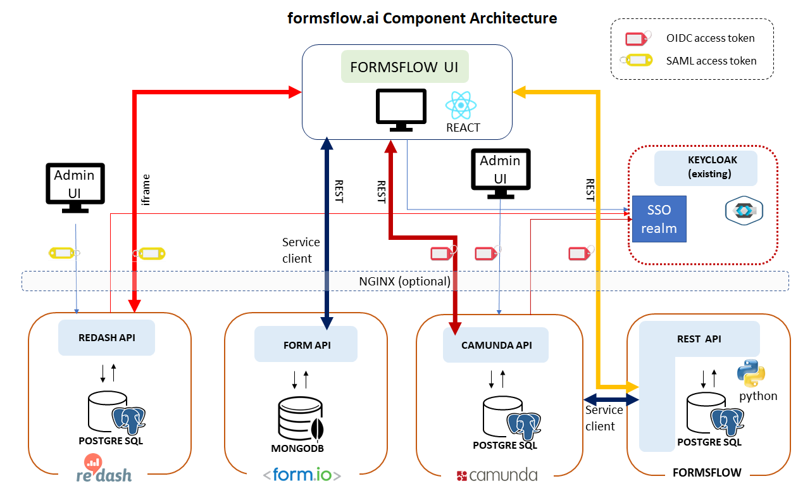

# FormsFlow.AI
**FormsFlow.AI** is an open source solution framework developed and maintained by [AOT Technologies](https://www.aot-technologies.com/). The framework combines selected  open source Forms, Workflow, Analytics and Security products with custom-built integration code to provide a seamless solution which provides a viable alternative to expensive, enterprise software products.

## Table of Contents
* [About the Project](#about-the-project)
  * [Project Dependencies](#project-dependencies)
  * [Project Tree](#project-tree)
* [Features](#features)
* [System Architecture](#system-architecture)
* [User and Roles](#users-and-roles)
* [System Operation](#system-operation)
* [Deployment and Configuration](#deployment-and-configuration)
  * [Prerequisites](#prerequisites)
  * [Configure and Build](#configure-and-build)
* [Running the Application](#running-the-application)
* [Managing Forms](#managing-forms)
* [Managing Workflows](#managing-workflows)
* [Managing Analytics Dashboard](#managing-analytics-dashboard)
* [Linking Forms to Workflows](#linking-forms-to-workflows)
* [License](#license)
* [Links](#links)

## About the Project
The project was initiated by AOT Technologies as a means of addressing the general situation whereby end-users fill in a form, the form is processed and there may be a requirement to report on the form metrics or data. Typical use cases are:

* Applications for licences
* Public submissions
* FOI requests
* Applications for funding
* Statements of compliance
* Employee onboarding
* Performance Reviews
* Emergency processes
* Escalations
* Surveys
* Case Management

### Project Dependencies


- [form.io](https://www.form.io/opensource) (included under ./forms-flow-forms)
- [Camunda](https://camunda.com/) (included under ./forms-flow-bpm)
- [Redash](https://redash.io) (included under ./forms-flow-analytics)
- [Keycloak](https://www.keycloak.org/) (existing Keycloak server required)
- [Python](https://www.python.org/) (included under ./forms-flow-api)
- *Optional*: [Nginx](https://www.nginx.com) (included under ./deployment/nginx) 

### Project Tree


 * [README.md](./README.md) This file
 * [deployment](./deployment) Deployment of complete framework
    * [docker](./deployment/docker) Deployment using docker 
      * [README](./deployment/docker/README.md)
    * [nginx](./deployment/nginx) Deployment on a remote host using nginx
      * [README](./deployment/nginx/README.md)

 * [forms-flow-analytics](./forms-flow-analytics) Redash analytics components
   * [README](./forms-flow-analytics/README.md)
 * [forms-flow-bpm](./forms-flow-bpm) Camunda Workflow deployment and integration
    * [README](./forms-flow-bpm/README.md)
 * [forms-flow-forms](./forms-flow-forms) form.io deployment and  integration
   * [README](./forms-flow-forms/README.md)
 * [forms-flow-idm](./forms-flow-idm) Identity Management (Keycloak)
   * [README](./forms-flow-idm/README.md)
 * [forms-flow-web](./forms-flow-web) FormsFlow integration web UI
   * [README](./forms-flow-web/README.md)
* [forms-flow-api](./forms-flow-api) REST API to FormsFlow.AI integration components
   * [README](./forms-flow-api/README.md)

Features 
------------------
-  Drag-and-drop forms-builder with rich UI components
-  Lightweight server-based workflow engine with full capabilities including human, parallel, asynchronous and timed flows, decision engine and graphical designer
- Notifications engine for notifications, reminders and alerts on tasks and even data thresholds.
- Metrics and data visualization dashboards for display of key workflow and form data
- (future) Multi-tenancy isolation
- Containerized deployment with docker, docker-compose and (soon) Openshift
- Flexible Identity Management uses existing IDM systems for authentication and single sign-on

## System Architecture




### Components 

The components of the system are:
#### FormsFlow UI
Browser-based React integration web UI
Most of the day-to-day end-user and review tasks are performed from this application,  built specifically to act as a common UI combining forms, workflow and analytics functionality. The web-application is written as a [progressive](https://en.wikipedia.org/wiki/Progressive_web_application) app with potential for offline data-entry. FormsFlow UI accesses the individual system component data through native API's using OIDC or SAML access tokens.

#### Redash Admin UI
The native admin interface to Redash (bundled and unchanged). Use this to build analytics dashboards.
#### Redash API
The REST interface to the Redash core. Bundled and unchanged
#### Form.io API
The REST interface to the form.io core
#### Camunda Admin UI
The native admin interface to Camunda (bundled and unchannged) . Use this to define workflows and to manage workflow tasks as an admin.
#### REST API
Python REST API providing business logic around internal FormsFlow Postgres database. This API is used extensively by the FormsFlow UI to synchronize, maintain state, extend functionality and integrate between components.
#### Nginx Web server (optional)
Webserver providing reverse-proxy redirection and SSL to components for remote deployments. ( bundled and configured ) 

#### Keycloak Identity management server 
The system  uses an existing (your) Keycloak server which provides a common identity management capability. Provisioning of the Keycloak server is not part of this project, however there are specific [Keycloak configuration tasks](./forms-flow-idm/keycloak-setup.md) which are required for this project. 

## Users and Roles

The framework defines user roles which are standardised across all the products. During the installation process, component-specific variants of these roles are set up , these need to be added to the main .env file in order to provide seamless integration:

- formsflow-designer  
  * Design and manage electronic forms
- formsflow-analyst  
  * Create metrics and analytics dashboards. 
- formsflow-bpm
  * Create workflows and associate forms with deployed workflows
- formsflow-reviewer
  * Receive and process online submissions. 
  * Fill in forms on behalf of the client if needed. 
  * View reports on analytics (slice 'n dice the data within the form) and metrics (details about the process eg. how many cases processed per day  )
- formsflow-client 
  * Fill in and submit online form(s)

A user may be assigned multiple roles. User, group and role creation and management is performed in  Keycloak by the Keycloak administrator. 

  For example it is possible to assign a user to roles formsflow-analyst and formsflow-reviewer, which would allow the user to not only process forms but also design analytics dashboards. 


## System Operation

In general, operation is as follows :

**Note** The URL links assume a local installation on the default ports as per the [installation instructions](./deployment/docker/README.md ):

#### End-user
* End-user logs into FormsFlow UI at url http://localhost:3000/
* User is redirected to Keycloak via OIDC where user's roles are returned as OIDC claims in a JWT
* User selects a form from the list of forms available. The available forms can be filtered by the user group with advanced configuration, by default the user sees all forms published. Form details are provided through form.io 
* The user fills in the form and submits it
* The form data is added to the Mongo DB. Details of the transaction are added to the Postgress DB
* A task is created on the Camunda server corresponding to the form type
* Notifications are sent to reviewers associated with that task type

#### Reviewer

* Reviewer logs into FormsFlow UI at url http://localhost:3000/
* Reviewer is redirected to Keycloak via OIDC where user's roles are returned as OIDC claims in a JWT. The fact that the reviewer has a reviewer role from Keycloak enables additional capabilities in the UI.
* Reviewer accesses task from task list. Tasks are retrieved through the Camunda API, filtered by the reviewer group memberships mapped between Keycloak and native Camunda. 
* Reviewer claims a task and processes it. The task moves to the next step in the workflow, with appropriate notifications and actions specific to that workflow.
* Reviewer  has the capability to access forms from the forms list, filtered by the group permissions of the user groups as per advanced configuration.
* Reviewer  has the ability to access metrics data from Postgres database filtered according to the configuration. FormsFlow UI renders these metrics into usable pages. 
* Reviewer has the ability to access Redash analytics dashboards (as iframes). 

#### Designers / Administrators

These users are responsible for accessing the native capabilities of the embedded products in order to configure analytics dashboards, create and manage workflows and create and manage forms. It is beyond the scope of this document to describe the detailed functionality of these products, however the general process is :

* Access product URL as follows:
  * Camunda: http://localhost:8000/camunda/
  * form.io: http://localhost:3001/ (the form designer is embedded into the FormsFlow UI)
  * Redash: http://localhost:7000/
* The login process is the same for all of them, redirect to Keycloak as OIDC (SAML for Redash) and optain the appropriate JWT + claims. 
* For the forms designer, the FormFlow UI recognises the additional role of formsflow-designer and enables a form design capability
* For Redash and Camunda, there is a mapping in the configuration file which needs to be setup between formsflow-analyst and formsflow-bpm and the corresponding groups in Redash and Camunda respectively. This is all covered in the installation instructions.


## Deployment and Configuration
 The framework installs the products mentioned above (with the exception of Keycloak which must either be pre-existing or installed and configured in advance).

The products are installed with a default configuration so that the base system works "out-the-box", however the advanced configuration and management of the products requires the relevant product documentation. 

### Prerequisites

* Admin access to a local or remote server (can be local PC or Mac provided it is 64-bit with at least 16GB RAM and 100GB HDD) where [docker-compose](https://docker.com) and [docker](https://docker.com) are installed and configured. 
* Admin access to a [Keycloak](https://www.keycloak.org/) server  (ability to create realms, users etc.)

### Configure and Build

* Clone this github repo
* Change directory   to deployment/docker folder  ```cd ./deployment/docker```
* Follow the instructions in the [README](./deployment/docker/README.md)
* If deploying to a remote server, you can use nginx as a reverse proxy and SSL engine. To help you, follow the instructions in the nginx [README](./deployment/nginx/README.md)


## Running the Application
* Ensure that the configuration and installation steps have been followed
* Change directory to deployment/docker folder  ```cd ./deployment/docker```
* Run `docker-compose up -d` to start.
* The following applications will be started and can be accessed in your browser.
         - http://localhost:3000 - FormsFlow UI (+ forms designer) 
         - http://localhost:7000 - Redash analytics
         - https://localhost:8000/camunda - Camunda BPM
    
## Managing Forms

  * Login to **http://localhost:3000/** using valid **designer** credentials
  * Navigate to menu **Forms**
  * Click the button **+ Create Form** to launch the form designer studio.
  * Design the form using **Drag and Drop** of components from LHS to RHS and publish by clicking the button **Create Form**.

To know more about form.io, go to https://help.form.io/userguide/introduction/.

## Managing Workflows

* You would need the Camunda Modeler to design your BPMN: https://camunda.com/download/modeler/
* To learn about designing your BPMN, go to https://docs.camunda.org/get-started/quick-start/service-task/
* To learn about deploying your BPMN, go to https://docs.camunda.org/get-started/quick-start/deploy/. Note that your default endpoint for Camunda's REST API is http://localhost:8000/camunda/engine-rest

## Managing Analytics Dashboard

* Login to **http://localhost:3000/** using valid **designer** credentials
* Create dashboard by following the [userguide](https://redash.io/help/user-guide/getting-started) 


## Linking Forms to Workflows
* Get the jwt token from formio resource **/user/login**
```
POST http://localhost:3001/user/login
{
    "data": {
        "email": {{email}},
        "password": {{password}}
    }
}
```
* Get the form ID of form' from formio resource **/export** 
```
GET http://localhost:3001/export

Headers:
Content-Type : application/json
x-jwt-token: {x-jwt-token}
```
* Get the process definition key from .bpmn

* Get the access token
```
POST {Keycloak URL}/auth/realms/forms-flow-ai/protocol/openid-connect/token

Body:
grant_type: client_credentials
client_secret: a3413dbd-caf2-41a8-ae54-e7aa448154d8
client_id: forms-flow-bpm

Headers:
Content-Type : application/x-www-form-urlencoded
```   
* Create form using the resource **/form**
```
POST http://localhost:5000/form

Body:
{
  "created_by": "userid",
  "formId": "5ee10121d8f7fa73e2402a52",
  "formName": "Feedback Form",
  "formRevisionNumber": "V1",
  "processKey": "onestepapproval",
  "processName": "One Step Approval",
  "comments": "OK"
}

Headers:
Content-Type : application/json
Authorization: Bearer {access_token}

```


 ## License

Copyright 2020 AppsOnTime-Technologies 2020

Licensed under the Apache License, Version 2.0 (the "License");
you may not use this file except in compliance with the License.
You may obtain a copy of the License at

    http://www.apache.org/licenses/LICENSE-2.0

Unless required by applicable law or agreed to in writing, software
distributed under the License is distributed on an "AS IS" BASIS,
WITHOUT WARRANTIES OR CONDITIONS OF ANY KIND, either express or implied.
See the License for the specific language governing permissions and
limitations under the License.

## Links

* [Web site](https://www.aot-technologies.com/)
* [Source code](https://github.com/AOT-Technologies/forms-flow-ai)

