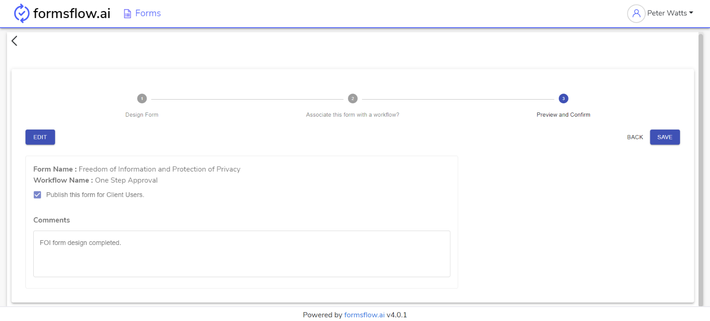
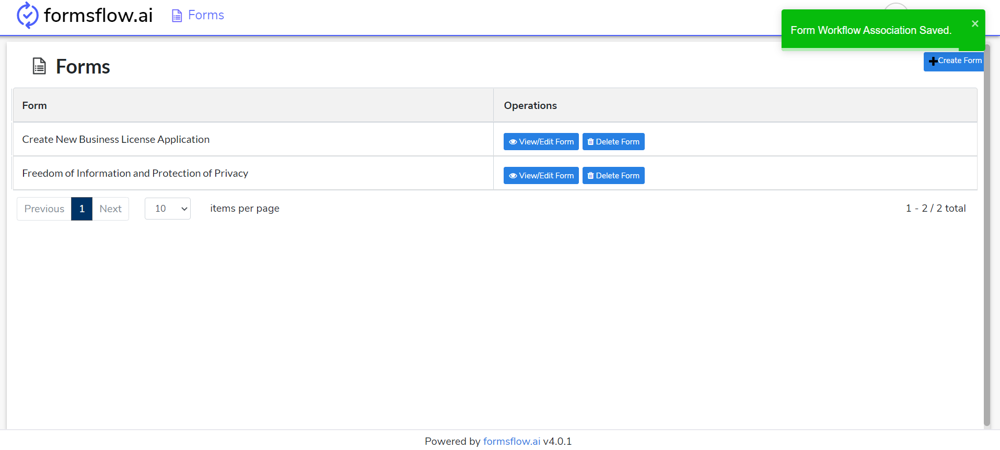
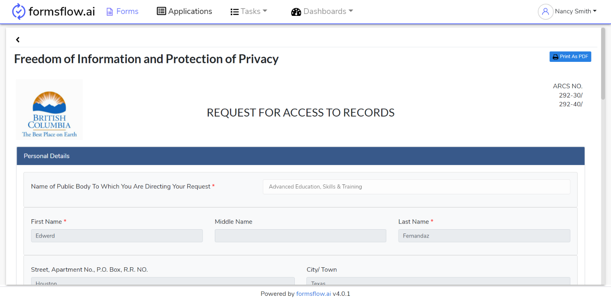

# Usage Instructions
In the following document, we’ll describe about the step by step instructions to set up a working sample in formsflow.ai solution.

## Table of Contents
1. [Usage Instructions](#usage-instructions)
2. [Usage Instructions with example](#usage-instructions-with-example)
3. [Links](#links)

## Usage Instructions

> The following instructions can be followed after the successful healthcheck of all formsflow.ai services.

### [STEP 1](#) Designer Task
   * Log in to http://localhost:3000 (forms-flow-web) with valid [default user credentials for designer](./forms-flow-idm/keycloak/README.md#formsflow-ai-user-credentials).
   * After the log in is successful you will be redirected to http://localhost:3000/form where you can Create / View / Edit / Delete a form.
   * To create a form you can click on **Create Form Button** where you can use the integrated form.io library to create a form with ease.
   * Once the form creation is completed click on **Save & Preview Button**, you can modify the form by clicking on **Edit Button** or click on **Next Button** to proceed further at this point.
   * At this stage form designing is completed, you can click on **EDIT Button** and associate a workflow if needed.
   * After the associate workflow is completed click on **Next Button** to Preview and Confirm.
   * You can click on **EDIT Button** and publish the form for clients to sent it for client usage.
   * Click on **SAVE Button** to completed designing a form.
   * Form designing is successfully completed, you can now Log out and go to [STEP 2](#) 
### [STEP 2](#) Client Task
   * Log in to http://localhost:3000 (forms-flow-web) with valid [default user credentials for client](./forms-flow-idm/keycloak/README.md#formsflow-ai-user-credentials).
   * After the log in is successful you will be redirected to http://localhost:3000/form where you can View and Submit a form.
   * Click **Submit New Button** on the form which you wanted to submit.
   * The previous action will redirect you to the form, where you can fill the details and Submit.
   * Fill the details and Submit the form, You can repeat this action as per your requirement.
   * If you had associated a workflow with the form, the form will start the workflow.
   * This action is completed, you can now Log out and go to [STEP 3](#) if you have a user review mentioned in your workflow.
### [STEP 3](#) Reviewer Task
   * Log in to http://localhost:3000 (forms-flow-web) with valid [default user credentials for reviewer](./forms-flow-idm/keycloak/README.md#formsflow-ai-user-credentials).
   * After the log in is successful you will be redirected to http://localhost:3000/task where you can navigate to Applications tab to View submissions.
   * You can View the submissions against a form by clicking on **View Submissions Button**
   * You can also submit a new form like [STEP 2](#) from the Forms Tab.
   * Reviewer action is completed.

## Usage Instructions with example

> The following instructions are using an example form from the form.io - FeedBack form

* End to end flow of a form is explained below using eg: Feedback form.

### [STEP 1](#) Designer Task
* Log in to http://localhost:3000 (forms-flow-web) with valid [default user credentials for designer](./forms-flow-idm/keycloak/README.md#formsflow-ai-user-credentials).
* After the log in is successful you will be redirected to http://localhost:3000/form where you can Create / View / Edit / Delete a form.

> Feedback form is already created, so the below step can be skipped
* To create a form you can click on **Create Form Button** where you can use the integrated form.io library to create a form with ease.
* Once the form creation is completed click on **Save & Preview Button**, you can modify the form by clicking on **Edit Button** or click on **Next Button** to proceed further at this point.

* At this stage form designing is completed, you can click on **EDIT Button** and associate a workflow if needed eg: One Step Review with Notifications (With Example).

* After the associate workflow is completed click on **Next Button** to Preview and Confirm.
* You can click on **EDIT Button** and publish the form for clients to sent it for client usage.

* Click on **SAVE Button** to completed designing a form.

* Form designing is successfully completed, you can now Log out and go to [STEP 2](#)

### [STEP 2](#) Designer Task

* Log in to http://localhost:3000 (forms-flow-web) with valid [default user credentials for client](./forms-flow-idm/keycloak/README.md#formsflow-ai-user-credentials).
* After the log in is successful you will be redirected to http://localhost:3000/form where you can View and Submit a form.

* Click **Submit New Button** on the form which you wanted to submit.
* The previous action will redirect you to the form, where you can fill the details and Submit.

* Fill the details and Submit the form, You can repeat this action as per your requirement.
* If you had associated a workflow with the form, the form will start the workflow.
* This action is completed, you can now Log out and go to [STEP 3](#) if you have a user review mentioned in your workflow.
   
### [STEP 3](#) Designer Task

* Log in to http://localhost:3000 (forms-flow-web) with valid [default user credentials for reviewer](./forms-flow-idm/keycloak/README.md#formsflow-ai-user-credentials).
* After the log in is successful you will be redirected to http://localhost:3000/task where you can navigate to Applications tab to View submissions.

* You can View the submissions against a form by clicking on **View Submissions Button**

* You can also submit a new form like [STEP 2](#) from the Forms tab.
* Reviewer action is completed.

## Links

* [Web site](https://formsflow.ai/)
* [Youtube Link](https://youtu.be/_H-P3Av3gqg)

