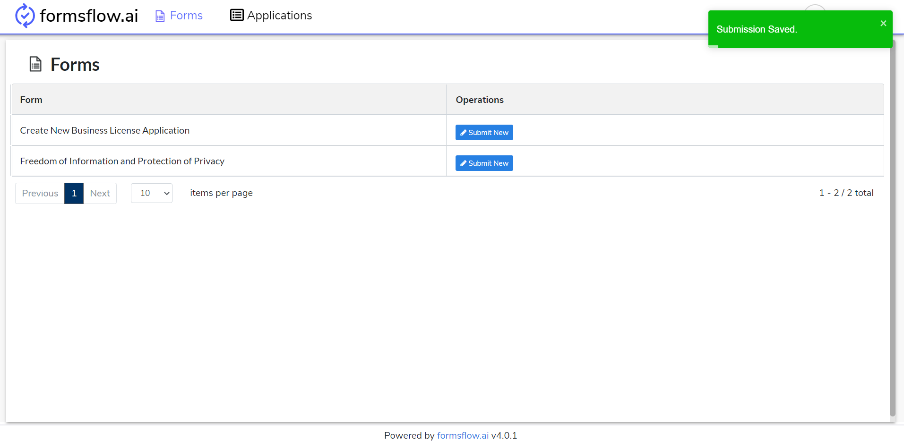

# Usage Instructions
In the following document, we’ll describe about the step by step instructions to set up a working sample in formsflow.ai solution.

## Table of Contents
1. [Usage Instructions](#usage-instructions)
2. [Usage Instructions with build-in examples](#usage-instructions-with-example)
3. [Links](#links)

## Usage Instructions

> The following instructions can be followed to use formsflow.ai solution after the successful healthcheck of all formsflow.ai services.

### [STEP 1](#) Designer Task
   * Log in to http://localhost:3000 (forms-flow-web) with valid [user credentials for designer](./forms-flow-idm/keycloak/README.md#formsflow-ai-user-credentials).
   * After the log in is successful, you will be redirected to http://localhost:3000/form where you can `Create/View/Edit/Delete a form`.
   * To create a new form click on **Create Form Button**. Now you can use the Drag-and-drop forms-builder with rich UI components to create a form with ease.
   * Once the form creation is completed click on **Save & Preview Button**, you can modify the form by clicking on **Edit Button** or click on **Next Button** to proceed further at this point.
   * At this stage form designing is completed, you can click on **EDIT Button** and associate a workflow if needed.
   * After the workflow association is completed click on **Next Button** to preview and confirm.
   * You can click on **EDIT Button** and publish the form for clients to sent it for client usage.
   * Click on **SAVE Button** to completed designing a form.
   * Form designing is successfully completed, you can now **Log out** and go to [STEP 2](#) 
   
### [STEP 2](#) Client Task
   * Log in to http://localhost:3000 (forms-flow-web) with valid [user credentials for client](./forms-flow-idm/keycloak/README.md#formsflow-ai-user-credentials).
   * After the log in is successful you will be redirected to http://localhost:3000/form where you can `View and Submit a form`.
   * Click **Submit New Button** on the form which you wanted to submit.
   * The previous action will redirect you to the form, where you can fill the details and Submit.
   * Fill the details and Submit the form, You can repeat this action as per your requirement.
   * If you had associated a workflow with the form, the form will start the workflow.
   * This action is completed, you can now Log out and go to [STEP 3](#) if you have a user review mentioned in your workflow.
   
### [STEP 3](#) Reviewer Task
   * Log in to http://localhost:3000 (forms-flow-web) with valid [user credentials for reviewer](./forms-flow-idm/keycloak/README.md#formsflow-ai-user-credentials).
   * After successful login you will be redirected to http://localhost:3000/task where you can navigate to `Tasks tab` to see the tasks pending to be reviewed.
   * You can click on a particular task and review the task accordingly. There are option to **Filter Tasks** and **sorting by Created Date** to easily search the task you want.
   * On selecting a particular task there are options to modify **Assignee/ Groups / Due Date / FollowUp Date**.
   * Also you can view the **Form/ History / Diagram**
   * You can navigate to **Applications tab** to view form submissions.
   * You can View the submissions against a form by clicking on **View Submissions Button**
   * You can also submit a new form like [STEP 2](#) from the Forms Tab.
   * You can navate to **Dashboards** tab to see the analytics of our solution
     * You can navigate to **Metrics** tab to see an overview of the total form submissions and associated application status to indicate which stage of workflow it is now.
     * You can navigate to **Insights** tab to see wonderful dashboard created in formsflow.ai analytics server.
   * Reviewer action is completed.

## Usage Instructions with example

> The following instructions are using an example form from the form.io - FeedBack form

* End to end flow of a form is explained below using eg: Feedback form.

### [STEP 1](#) Designer Task
* Log in to http://localhost:3000 (forms-flow-web) with valid [user credentials for designer](./forms-flow-idm/keycloak/README.md#formsflow-ai-user-credentials).
* After the log in is successful you will be redirected to http://localhost:3000/form where you can Create / View / Edit / Delete a form.

<!--  -->

* To create a new form click on **Create Form Button**. You can use the Drag-and-drop forms-builder with rich UI components to create a form with ease.
> Product Survey form is already created, so we are skipping the step of creating Form.
* You can modify the form by clicking on **View/Edit Form** button and you can edit form design by clicking the **Edit Form** button or continue by moving next if Form design is completed.

<!--  -->

* At this stage form designing is completed, you can click on **EDIT Button** and associate a workflow - Product Survey Administrator with Notification(Example).

<!--  -->

* After the associate workflow is completed click on **Next Button** to Preview and Confirm.
* You can click on **EDIT Button** and publish the form for clients to sent it for client usage.

<!--  -->

* Click on **SAVE Button** to completed designing a form.

<!--  -->

* Form designing is successfully completed, you can now Log out and go to [STEP 2](#)

### [STEP 2](#) Client Tasks

* Log in to http://localhost:3000 (forms-flow-web) with valid [default user credentials for client](./forms-flow-idm/keycloak/README.md#formsflow-ai-user-credentials).
* After the log in is successful you will be redirected to http://localhost:3000/form where you can View and Submit a form.

<!--  -->

* Click **Submit New Button** on the form which you wanted to submit.
* The previous action will redirect you to the form, where you can fill the details and Submit.

<!--  -->
<!--  -->

* Fill the details and Submit the form, You can repeat this action as per your requirement.

  
* If you had associated a workflow with the form, the form will start the workflow.
* This action is completed, you can now Log out and go to [STEP 3](#) if you have a user review mentioned in your workflow.
   
### [STEP 3](#) Reviewer Tasks

* Log in to http://localhost:3000 (forms-flow-web) with valid [default user credentials for reviewer](./forms-flow-idm/keycloak/README.md#formsflow-ai-user-credentials).
* After the log in is successful you will be redirected to http://localhost:3000/task.

<!--  -->

* You can navigate to Applications tab to **View the Form** submissions.
<!--  -->
<!--  -->
<!--  -->

* You can View the submissions against a form by clicking on **View** button.

* You can even print the Form submission as a PDF which can be rendered in browser

* You can also submit a new form like **Employee Feedback Form** as in [STEP 2](#) from the **Forms** tab.

* Based on the **Employee Feedback** form workflow associated, the form is supposed to be send to a manager with the reviewer role.

* On submitting form, the associated task can be found for the reviewer role in the **Task Menu** section for the Manager

* On clicking the associated task, the task detailed menu usually has three sections - **Forms**, **History**, **Diagram**

* On claiming the task, the Manager can fill the form and submit his review
* Reviewer action is completed.

## Links

* [Web site](https://formsflow.ai/)
* [Youtube Link](https://youtu.be/_H-P3Av3gqg)

