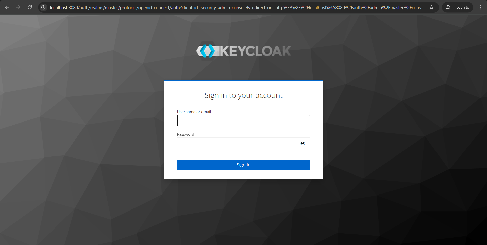
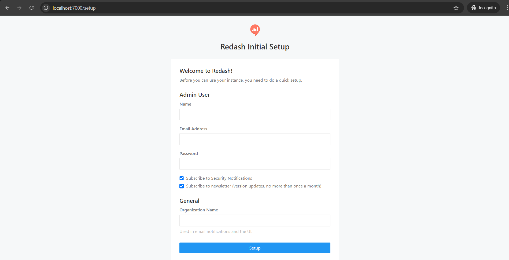
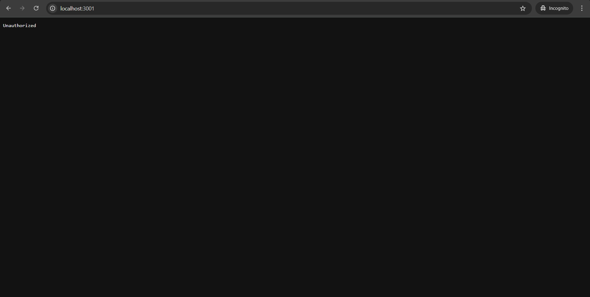
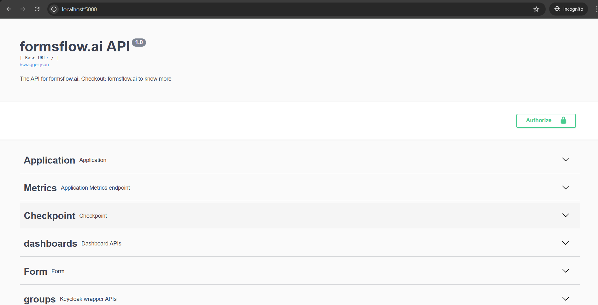
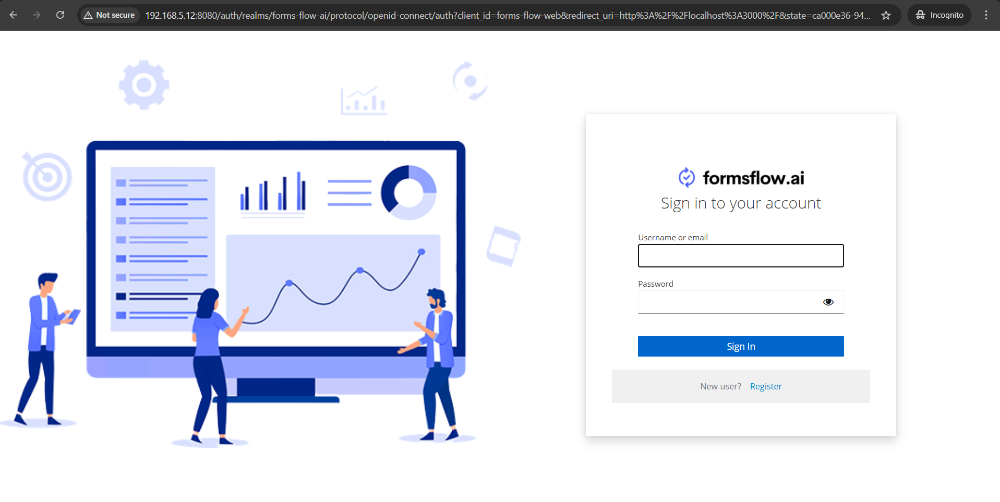
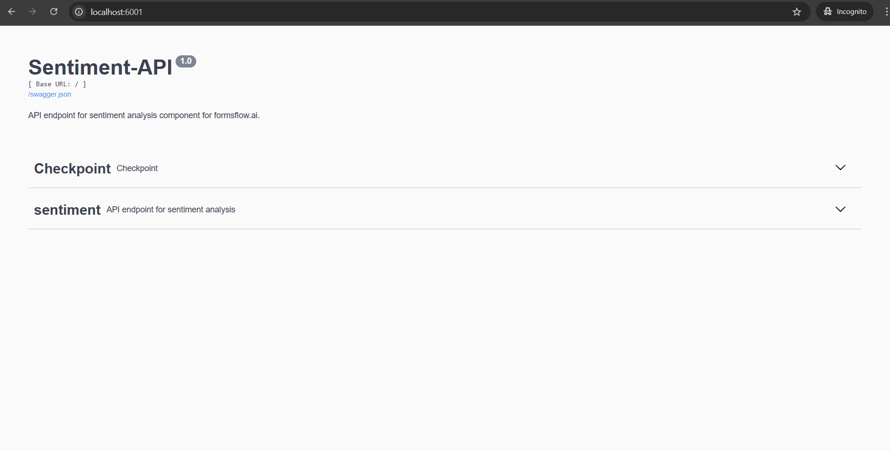

# [**formsflow.ai**](https://formsflow.ai/) Individual Deployment

## Overview

[**formsflow.ai**](https://formsflow.ai/) is an open-source, low-code business process automation platform that integrates forms, workflows, and analytics. This guide provides step-by-step instructions to deploy formsflow.ai as individual components.

## Prerequisites

Ensure the following prerequisites are met before proceeding with the deployment:

- Docker installed
- Docker Compose installed

## Clone the Repository

```bash
git clone https://github.com/AOT-Technologies/forms-flow-ai.git
cd forms-flow-ai
```

#### Download ZIP file:
Alternatively, you can download the ZIP file from the following link:
[Download ZIP](https://github.com/AOT-Technologies/forms-flow-ai/archive/refs/heads/master.zip)
Extract the ZIP file and navigate into the project directory:

```bash
unzip forms-flow-ai-master.zip
cd forms-flow-ai-master
```

## Deploy Individual Components

Ensure Docker is running and execute the following commands to deploy the required components:

### Forms-flow-idm

The [**formsflow.ai**](https://formsflow.ai/) framework could be hooked up with any OpenID Connect compliant Identity Management Server. To date, we have only tested [Keycloak](https://github.com/keycloak/keycloak).

```bash
cd forms-flow-idm/keycloak
docker-compose up -d
```
Before deploying, rename `sample.env` to `.env`

Wait until the service is up and running, then access it at http://localhost:8080/auth



### Forms-flow-analytics
[**formsflow.ai**](https://formsflow.ai/) leverages [Redash](https://github.com/getredash/redash) to build interactive
dashboards and gain insights. To create meaningful visualization for
your use case with formsflow.ai checkout [Redash Knowledge base](https://redash.io/help/).

```bash
cd forms-flow-analytics
docker-compose run --rm server create_db
docker-compose up --build -d
```
Before deploying, rename `sample.env` to `.env`

Replace `{your-ip-address}` with your local IP address

Wait until it's up and running, then access it at http://localhost:7000



### Forms-flow-forms

[**formsflow.ai**](https://formsflow.ai/) leverages form.io to build "serverless" data management applications using a simple drag-and-drop form builder interface.

To know more about form.io, go to  <https://form.io>.

```bash
cd forms-flow-forms
docker-compose up --build -d
```
Before deploying, rename `sample.env` to `.env`

Replace `{your-ip-address}` with your local IP address

Wait until it's up and running, then access it at http://localhost:3001




### Forms-flow-redis

This repository contains a Docker Compose configuration to set up a lightweight Redis service using the official Redis Alpine image.

```bash
cd forms-flow-redis
docker-compose up -d
```
`forms-flow-redis` is required for `forms-flow-api` and `forms-flow-documents-api` to function correctly.

### Forms-flow-api

[**formsflow.ai**](https://formsflow.ai/) has built this adaptive tier for correlating form management, BPM and analytics together.

The goal of the REST API is to provide access to all relevant interfaces of
the system. It is built using Python.

```bash
cd forms-flow-api
docker-compose up --build -d
```
Before deploying, rename `sample.env` to `.env` and update the values in `.env`

Replace `{your-ip-address}` with your local IP address

Wait until it's up and running, then access it at http://localhost:5000



### Forms-flow-documents-api

The goal of the document API is to generate pdf with form submission data. It is built using Python.

```bash
cd forms-flow-documents-api
docker-compose up --build -d
```
Before deploying, rename `sample.env` to `.env` and update the values in `.env`

Replace `{your-ip-address}` with your local IP address

Wait until it's up and running, then access it at http://localhost:5006


### Forms-flow-bpm

**formsflow.ai** leverages Camunda for workflow and decision automation.

To know more about Camunda, visit https://camunda.com/.

```bash
cd forms-flow-bpm
docker-compose up --build -d
```
Before deploying, rename `sample.env` to `.env` and update the values in `.env`

Replace `{your-ip-address}` with your local IP address

Wait until it's up and running, then access it at http://localhost:8000/camunda


### Forms-flow-web

A React library for rendering out forms based on the form.io platform.

Also [**formsflow.ai**](https://formsflow.ai/) provides a Vue.js based web user interface for easy integration of **formsflow.ai with your existing UI based on Vue**.

```bash
cd forms-flow-web-root-config
docker-compose up --build -d
```
Before deploying, rename `sample.env` to `.env` and update the values in `.env`

Replace `{your-ip-address}` with your local IP address

Wait until it's up and running, then access it at http://localhost:3000



### Forms-flow-data-analysis-api

Sentiment Analysisis used to understand the sentiments of the customer for products, movies, and other such things, whether they feel positive, negative, or neutral about it. BERT is a very good pre-trained language model which helps machines learn excellent representations of text with respect to context in many natural language tasks. 

The goal of the Data Analysis API is to provide access to all relevant interfaces of
the system. It is built using Python

```bash
cd forms-flow-data-analysis-api
docker-compose up --build -d
```
Before deploying, rename `sample.env` to `.env` and update the values in `.env`

Replace `{your-ip-address}` with your local IP address

Wait until it's up and running, then access it at http://localhost:6001



## Conclusion

By following these steps, you will have successfully deployed the [**formsflow.ai**](https://formsflow.ai/) components individually using Docker. Ensure each service is up and running before proceeding to the next to avoid dependency issues.