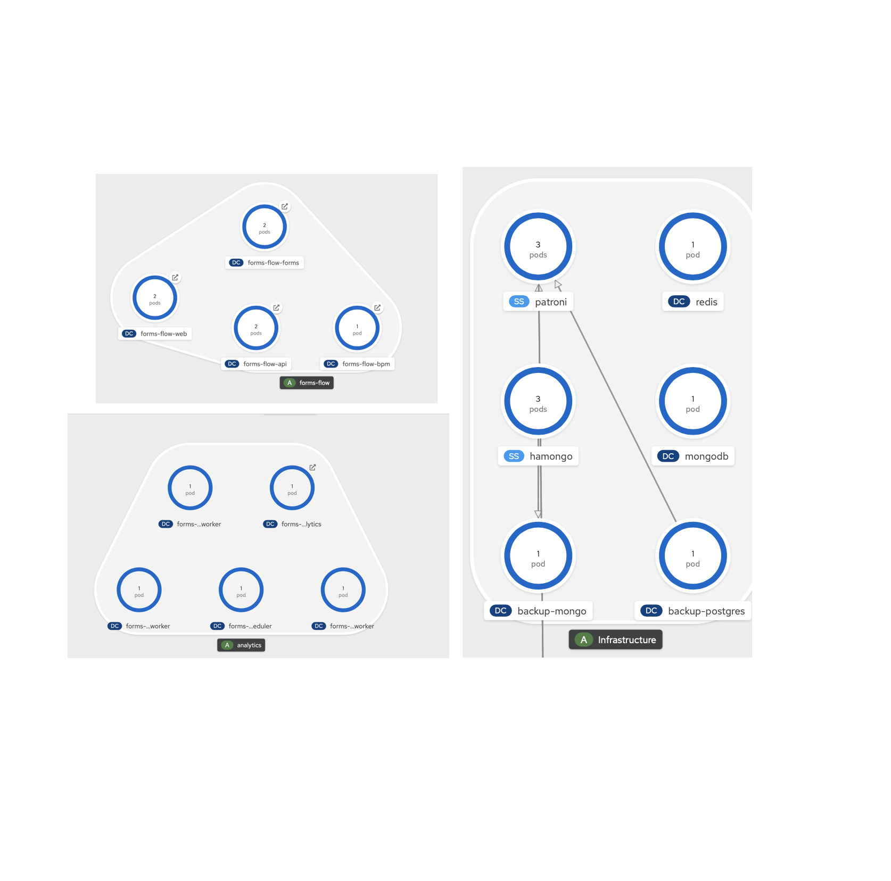

This page details deploying application in openshift. All the applicaiton are deployed using openshift templates.

_The templates are tested , ran and customised for running in BCGOV pathfinder OCP3 and Openshift 4 silver cluster , there could be particular places where the templates are opinionated. Feel free to alter them and generalise them for any kubernetes/openshift deployments_
	
	
Every component has a build config [bc], Deployment config and might have a param file. The general syntax for running them is 

`oc process -f web_dc.yaml --param-file=web_param.yaml |oc apply -f - --ignoreunknownparams`		

an ideal topology will look like 

Databases

## Databases

The application uses Postgres and Mongo DB for persistence.The below templates can be used as a reference to spin up new databases.Alternatively new databse schema can be created with in the existing database.

### how to deploy postgres
Postgres HA and Non-HA templates can be used.

A sample patroni templates can be found at [patroni-build.yaml](../openshift/Databases/patroni-build.yaml) , [patroni-build.yaml](../openshift/Databases/patroni-build.yaml) , [patroni-deployment.yaml](../openshift/Databases/patroni-deployment.yaml) , [patroni-deployment-prereq.yaml](../openshift/Databases/patroni-deployment-prereq.yaml) 

To avail the latest patroni templates ,Please refer to [BCDevOps/platform-services/patroni templates](https://github.com/BCDevOps/platform-services/tree/master/apps/pgsql/patroni)

A sample non-Ha template is checked in here at [postgres-non-ha template](../openshift/Databases/postgresql-deploy.json)

### how to deploy Mongo

Mongo HA and Non-HA templates can be used.

A sample Mongo HA template can be found at [mongo-ha.yaml](../openshift/Databases/mongo-ha.yaml)
A sample Mongo non-HA templates can be found at [mongodb-nonha.yaml](../openshift/Databases/mongodb-nonha.yaml)

# Secrets and Config maps

## secrets
The forms-flow-ai secret contain most of the values which are mandatory for application to work.

running the [formio_secrets_param.yaml](../openshift/formio_secrets.yaml) with proper values should create the required secret.

There are other secrets which are needed as well. They are mostly Mongo , Postgres,Redash secrets as in the below screenshot

## config maps

the two major config which are required to run the application is the forms-flow-web-config and forms-flow-web-keycloak-config. 
forms-flow-web-config contains the ids and urls required for web project to work.
forms-flow-web-keycloak-config has the keycloak configs.

## Build Configs/Images
                                                                      
Each project needs a build configuration and images/image stream to work with.An ideal build config will look like below.

## Deployment Configs

An example deployment config will look like below

[Dockerfile](../../forms-flow-web/Dockerfile)
[openshift_Dockerfile](/forms-flow-web/openshift_Dockerfile)
[openshift_custom_Dockerfile](/forms-flow-web/openshift_custom_Dockerfile)

# Docker files

the project has different deployment topoloiges and there are different docker files for each purpose as below

| filename        | sample reference           | Purpose  |
| ------------- |:-------------:| -----:|
| Dockerfile      | [Dockerfile](../../forms-flow-web/Dockerfile) | Dockerfile to support docker compose |
| openshift_Dockerfile      | [openshift_Dockerfile](../../forms-flow-web/openshift_Dockerfile)      |   Openshift based deployment |
| openshift_custom_Dockerfile | [openshift_custom_Dockerfile](../../forms-flow-web/openshift_custom_Dockerfile)      |    To allow customisation and build from this repo.Helps to copy stuff from the buidling repo and merge to the product. |