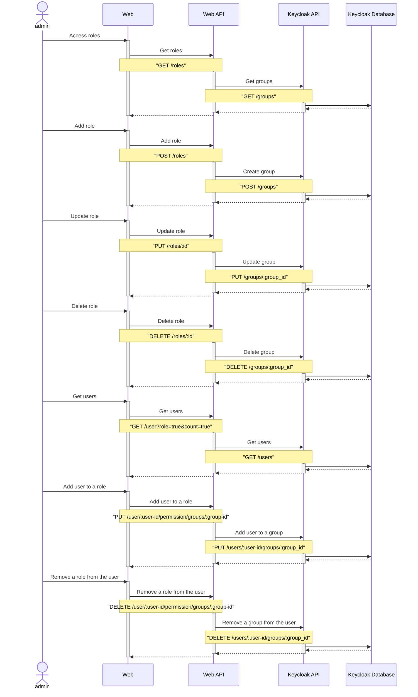

## Sequence flows for admin

Below is the sequence diagram for an admin user.

```mermaid
sequenceDiagram
    actor admin as admin
    participant web as Web   
    participant web-api as Web API
    participant keycloak-api as Keycloak API
    participant keycloak-db as Keycloak Database

    admin ->> web: Access roles
    activate web
    web ->> web-api: Get roles
    Note over web,web-api: "GET /roles"
    activate web-api
    web-api ->> keycloak-api: Get groups
    Note over web-api, keycloak-api: "GET /groups"
    activate keycloak-api
    keycloak-api ->> keycloak-db:
    keycloak-db -->> keycloak-api:
    keycloak-api -->> web-api:
    deactivate keycloak-api
    deactivate web-api
    web-api -->> web: 
    deactivate web

    admin ->> web: Add role
    activate web
    web ->> web-api: Add role
    Note over web,web-api: "POST /roles"
    activate web-api
    web-api ->> keycloak-api: Create group
    Note over web-api, keycloak-api: "POST /groups"
    activate keycloak-api
    keycloak-api ->> keycloak-db:
    keycloak-db -->> keycloak-api:
    keycloak-api -->> web-api:
    deactivate keycloak-api
    deactivate web-api
    web-api -->> web: 
    deactivate web

    admin ->> web: Update role
    activate web
    web ->> web-api: Update role
    Note over web,web-api: "PUT /roles/:id"
    activate web-api
    web-api ->> keycloak-api: Update group
    Note over web-api, keycloak-api: "PUT /groups/:group_id"
    activate keycloak-api
    keycloak-api ->> keycloak-db:
    keycloak-db -->> keycloak-api:
    keycloak-api -->> web-api:
    deactivate keycloak-api
    deactivate web-api
    web-api -->> web: 
    deactivate web

    admin ->> web: Delete role
    activate web
    web ->> web-api: Delete role
    Note over web,web-api: "DELETE /roles/:id"
    activate web-api
    web-api ->> keycloak-api: Delete group
    Note over web-api, keycloak-api: "DELETE /groups/:group_id"
    activate keycloak-api
    keycloak-api ->> keycloak-db:
    keycloak-db -->> keycloak-api:
    keycloak-api -->> web-api:
    deactivate keycloak-api
    deactivate web-api
    web-api -->> web: 
    deactivate web

    admin ->> web: Get users
    activate web
    web ->> web-api: Get users
    Note over web,web-api: "GET /user?role=true&count=true"
    activate web-api
    web-api ->> keycloak-api: Get users
    Note over web-api, keycloak-api: "GET /users"
    activate keycloak-api
    keycloak-api ->> keycloak-db:
    keycloak-db -->> keycloak-api:
    keycloak-api -->> web-api:
    deactivate keycloak-api
    deactivate web-api
    web-api -->> web: 
    deactivate web

    admin ->> web: Add user to a role
    activate web
    web ->> web-api: Add user to a role
    Note over web,web-api: "PUT /user/:user-id/permission/groups/:group-id"
    activate web-api
    web-api ->> keycloak-api: Add user to a group
    Note over web-api, keycloak-api: "PUT /users/:user-id/groups/:group_id"
    activate keycloak-api
    keycloak-api ->> keycloak-db:
    keycloak-db -->> keycloak-api:
    keycloak-api -->> web-api:
    deactivate keycloak-api
    deactivate web-api
    web-api -->> web: 
    deactivate web

    admin ->> web: Remove a role from the user
    activate web
    web ->> web-api: Remove a role from the user
    Note over web,web-api: "DELETE /user/:user-id/permission/groups/:group-id"
    activate web-api
    web-api ->> keycloak-api: Remove a group from the user
    Note over web-api, keycloak-api: "DELETE /users/:user-id/groups/:group_id"
    activate keycloak-api
    keycloak-api ->> keycloak-db:
    keycloak-db -->> keycloak-api:
    keycloak-api -->> web-api:
    deactivate keycloak-api
    deactivate web-api
    web-api -->> web: 
    deactivate web 

```