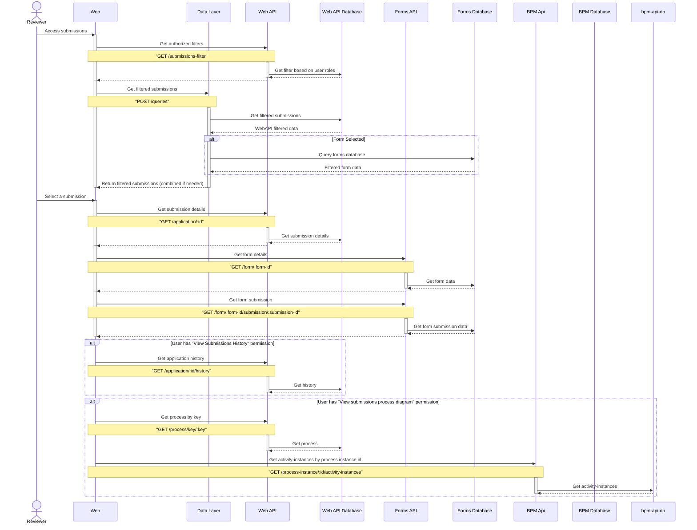

## Sequence flows for analyze submissions

Below is the sequence diagram for a reviewer user when they work on analyze submissions.

```mermaid
sequenceDiagram
    actor Reviewer as Reviewer
    participant web as Web
    participant data-layer as Data Layer    
    participant web-api as Web API
    participant web-api-db as Web API Database
    participant forms-api as Forms API
    participant forms-db as Forms Database
    participant bpm-api as BPM Api
    participant bpm-db as BPM Database

    Reviewer ->> web: Access submissions
    activate web
    web ->> web-api: Get authorized filters
    Note over web,web-api: "GET /submissions-filter"
    activate web-api
    web-api ->> web-api-db: Get filter based on user roles
    web-api-db -->> web-api: 
    deactivate web-api
    web-api -->> web: 
    deactivate web

    activate web
    web ->> data-layer: Get filtered submissions
    Note over web,data-layer: "POST /queries"
    activate data-layer
    %% Always fetch from Web API DB
    data-layer ->> web-api-db: Get filtered submissions
    web-api-db -->> data-layer: WebAPI filtered data

    %% Conditional flow: only if "Form" is selected
    alt Form Selected
        data-layer ->>forms-db: Query forms database
        forms-db -->>  data-layer: Filtered form data
    end

    %% Combine results and return
    data-layer -->> web: Return filtered submissions (combined if needed)
    deactivate data-layer
    deactivate web

    Reviewer ->> web: Select a submission
    activate web
    web ->> web-api: Get submission details
    Note over web,web-api: "GET /application/:id"
    activate web-api
    web-api ->> web-api-db: Get submission details
    web-api-db -->> web-api: 
    deactivate web-api
    web-api -->> web: 
    deactivate web

    activate web
    web ->> forms-api: Get form details
    Note over web,forms-api: "GET /form/:form-id"
    activate forms-api
    forms-api ->> forms-db: Get form data
    forms-db -->> forms-api: 
    deactivate forms-api
    forms-api -->> web: 
    deactivate web

    activate web
    web ->> forms-api: Get form submission
    Note over web,forms-api: "GET /form/:form-id/submission/:submission-id"
    activate forms-api
    forms-api ->> forms-db: Get form submission data
    forms-db -->> forms-api: 
    deactivate forms-api
    forms-api -->> web: 
    deactivate web

    %% Conditional block: only if user has permission
    alt User has "View Submissions History" permission
        web ->> web-api: Get application history
        Note over web,web-api: "GET /application/:id/history"
        activate web-api
        web-api ->> web-api-db: Get history
        web-api-db -->> web-api:
        deactivate web-api
   end

    %% Conditional block: only if user has permission
    alt User has "View submissions process diagram" permission
        web ->> web-api: Get process by key
        Note over web,web-api: "GET /process/key/:key"
        activate web-api
        web-api ->> web-api-db: Get process
        web-api-db -->> web-api:
        deactivate web-api

        web ->> bpm-api: Get activity-instances by process instance id
        Note over web,bpm-api: "GET /process-instance/:id/activity-instances"
        activate bpm-api
        bpm-api ->> bpm-api-db: Get activity-instances
        bpm-api-db -->> bpm-api:
        deactivate bpm-api
   end
    

```