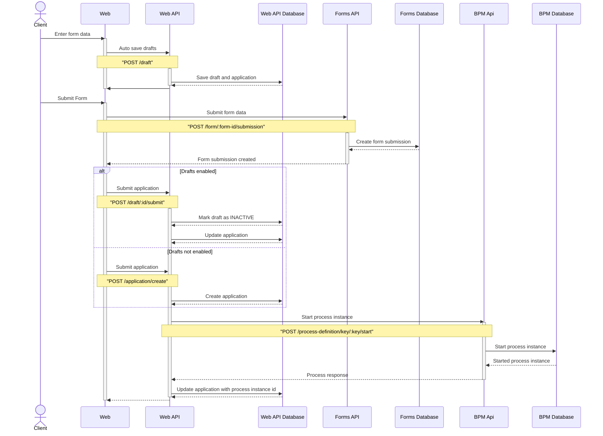

## Sequence flows for client user

Below is the sequence diagram for a client user when they submit a form.

```mermaid
sequenceDiagram
    actor Client as Client
    participant web as Web
    participant web-api as Web API
    participant web-api-db as Web API Database
    participant forms-api as Forms API
    participant forms-db as Forms Database
    participant bpm-api as BPM Api
    participant bpm-db as BPM Database

    Client ->> web: Enter form data
    activate web
    web ->> web-api: Auto save drafts
    Note over web,web-api: "POST /draft"
    activate web-api
    web-api ->> web-api-db: Save draft and application
    web-api-db -->> web-api: 
    deactivate web-api
    web-api ->> web: 
    deactivate web

    Client ->> web: Submit Form
    activate web
    web ->> forms-api: Submit form data
    Note over web,forms-api: "POST /form/:form-id/submission"
    activate forms-api
    forms-api->>forms-db: Create form submission
    forms-db -->> forms-api: 
    forms-api -->> web: Form submission created
    deactivate forms-api

    alt Drafts enabled
        web ->> web-api: Submit application
        Note over web,web-api: "POST /draft/:id/submit"
        activate web-api
        web-api->>web-api-db: Mark draft as INACTIVE
        web-api-db -->> web-api: 
        web-api->>web-api-db: Update application
        web-api-db -->> web-api: 
    else Drafts not enabled
        web ->> web-api: Submit application
        Note over web,web-api: "POST /application/create"
        web-api->>web-api-db: Create application
        web-api-db -->> web-api: 
    end

    

    web-api->>bpm-api: Start process instance
    activate bpm-api
    Note over web-api,bpm-api: "POST /process-definition/key/:key/start"
    bpm-api ->> bpm-db: Start process instance
    bpm-db -->> bpm-api: Started process instance
    bpm-api -->> web-api: Process response
    deactivate bpm-api
    web-api ->> web-api-db: Update application with process instance id
    web-api-db -->> web-api: 
    deactivate web-api
    web-api -->> web: 
    deactivate web


```