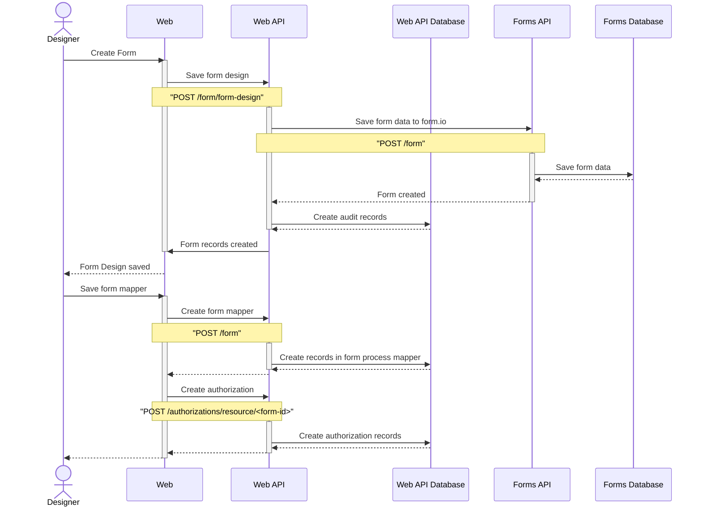

## Sequence flows for designer user

Below is the sequence diagram for a designer user when they create and save a form and associate its workflow.

```mermaid
sequenceDiagram
    actor Designer as Designer
    participant web as Web
    participant web-api as Web API
    participant web-api-db as Web API Database
    participant forms-api as Forms API
    participant forms-db as Forms Database

    Designer ->> web: Create Form
    activate web
    web ->> web-api: Save form design
    Note over web,web-api: "POST /form/form-design"
    activate web-api
    web-api ->> forms-api: Save form data to form.io
    Note over web-api,forms-api: "POST /form"
    activate forms-api
    forms-api->>forms-db: Save form data
    forms-db-->>forms-api: 
    forms-api -->> web-api: Form created
    deactivate forms-api
    web-api ->> web-api-db: Create audit records
    web-api-db -->> web-api: 
    deactivate web-api
    web-api ->> web: Form records created
    deactivate web
    web -->> Designer : Form Design saved

    Designer ->> web: Save form mapper
    activate web
    web ->> web-api : Create form mapper
    Note over web,web-api: "POST /form"
    activate web-api
    web-api ->> web-api-db : Create records in form process mapper
    web-api-db -->> web-api : 
    deactivate web-api
    web-api -->> web : 

    web ->> web-api : Create authorization
    Note over web,web-api: "POST /authorizations/resource/<form-id>"
    activate web-api
    web-api ->> web-api-db : Create authorization records
    web-api-db -->> web-api : 
    web-api -->> web : 
    deactivate web-api
    web -->> Designer : 
    deactivate web


```