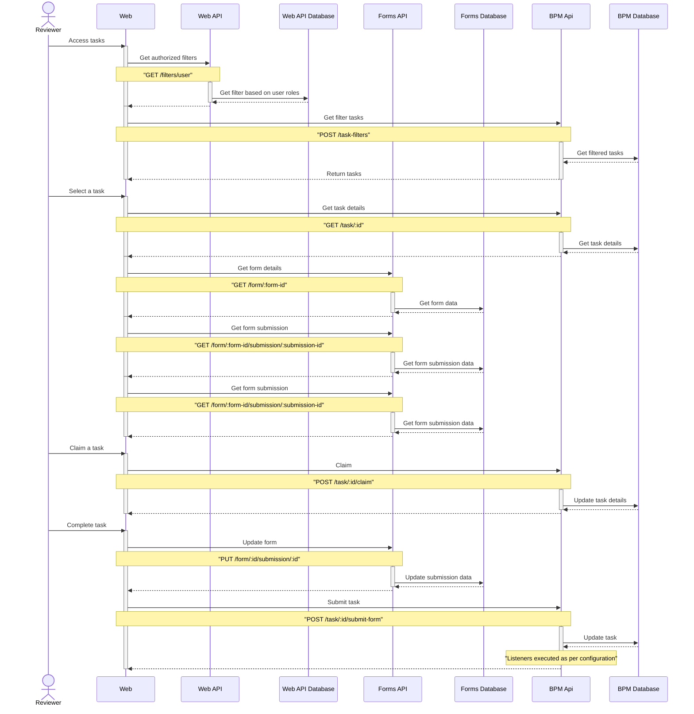

## Sequence flows for reviewer user

Below is the sequence diagram for a reviewer user when they work on tasks.

```mermaid
sequenceDiagram
    actor Reviewer as Reviewer
    participant web as Web
    participant web-api as Web API
    participant web-api-db as Web API Database
    participant forms-api as Forms API
    participant forms-db as Forms Database
    participant bpm-api as BPM Api
    participant bpm-db as BPM Database

    Reviewer ->> web: Access tasks
    activate web
    web ->> web-api: Get authorized filters
    Note over web,web-api: "GET /filters/user"
    activate web-api
    web-api ->> web-api-db: Get filter based on user roles
    web-api-db -->> web-api: 
    deactivate web-api
    web-api -->> web: 
    deactivate web

    activate web
    web ->> bpm-api: Get filter tasks
    Note over web,bpm-api: "POST /task-filters"
    activate bpm-api
    bpm-api->>bpm-db: Get filtered tasks
    bpm-db -->> bpm-api: 
    bpm-api -->> web: Return tasks
    deactivate bpm-api
    deactivate web

    Reviewer ->> web: Select a task
    activate web
    web ->> bpm-api: Get task details
    Note over web,bpm-api: "GET /task/:id"
    activate bpm-api
    bpm-api ->> bpm-db: Get task details
    bpm-db -->> bpm-api: 
    deactivate bpm-api
    bpm-api -->> web: 
    deactivate web

    activate web
    web ->> forms-api: Get form details
    Note over web,forms-api: "GET /form/:form-id"
    activate forms-api
    forms-api ->> forms-db: Get form data
    forms-db -->> forms-api: 
    deactivate forms-api
    forms-api -->> web: 
    deactivate web

    activate web
    web ->> forms-api: Get form submission
    Note over web,forms-api: "GET /form/:form-id/submission/:submission-id"
    activate forms-api
    forms-api ->> forms-db: Get form submission data
    forms-db -->> forms-api: 
    deactivate forms-api
    forms-api -->> web: 
    deactivate web

    activate web
    web ->> forms-api: Get form submission
    Note over web,forms-api: "GET /form/:form-id/submission/:submission-id"
    activate forms-api
    forms-api ->> forms-db: Get form submission data
    forms-db -->> forms-api: 
    deactivate forms-api
    forms-api -->> web: 
    deactivate web

    Reviewer ->> web: Claim a task
    activate web
    web ->> bpm-api: Claim
    Note over web,bpm-api: "POST /task/:id/claim"
    activate bpm-api
    bpm-api ->> bpm-db: Update task details
    bpm-db -->> bpm-api: 
    deactivate bpm-api
    bpm-api -->> web: 
    deactivate web

    Reviewer ->> web: Complete task
    activate web
    web ->> forms-api: Update form
    Note over web,forms-api: "PUT /form/:id/submission/:id"
    activate forms-api
    forms-api ->> forms-db: Update submission data
    forms-db -->> forms-api: 
    deactivate forms-api
    forms-api -->> web: 

    web ->> bpm-api: Submit task
    Note over web,bpm-api: "POST /task/:id/submit-form"
    activate bpm-api
    bpm-api ->> bpm-db: Update task
    bpm-db -->> bpm-api: 
    Note over bpm-api: "Listeners executed as per configuration"
    deactivate bpm-api
    bpm-api -->> web: 
    deactivate web

    

```