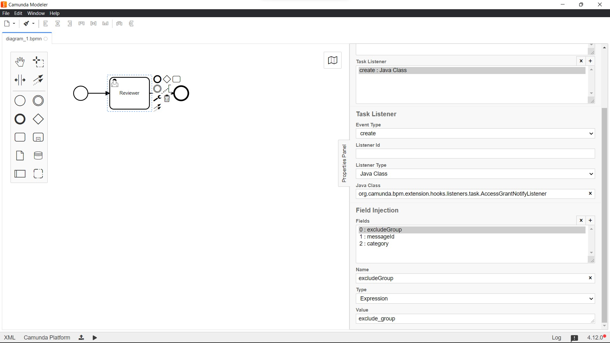

# Access Grant Notify Listner

**org.camunda.bpm.extension.hooks.listeners.task.AccessGrantNotifyListener**

This component can be used on **CREATE** event of task listener.  This component is aimed at sending notification to access groups.
## Table of Content
* [Type](#type)
* [How it Works](#how-it-works)
* [How to Use](#how-to-use)

## Type

Task Listener

### How it Works

This component relies on listed parameters.
a. excludeGroup [Mandatory = Yes]
b. messageId [Mandatory = Yes]
c. category [Mandatory = Yes]

- excludeGroup (Listener field of type expression): This maps to excluded groups.
- messageId (Listener field of type expression): This maps to the any process event.
- category (Listener field of type expression): This maps to the email template DMN category. 

### How to Use

Below snapshot shows how to configure the **AccessGrantNotifyListener** to a task. 

