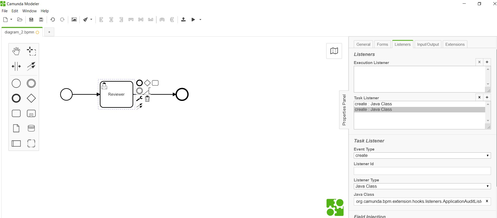

# Application Audit Listener 

**org.camunda.bpm.extension.hooks.listeners.ApplicationAuditListener**

This component can be used on any event of task or execution. Upon configuration, this send value from cam variables: "applicationStatus" and "formUrl" to formsflow.ai system for capturing audit.

NOTE: To be used, only when an audit i.e. history to be created without updating the application status.

## Table of Content
* [Type](#type)
* [How it Works](#how-it-works)
* [How to Use](#how-to-use)

## Type

Task/Execution Listener

### How it Works

This invokes the REST endpoint of application history **application/{id}/history**  with data from cam variables: "applicationStatus" and "formUrl".

The component is dependent on listed variables from camunda context,
1. applicationId 
2. applicationStatus
3. formUrl

### How to Use

Below snapshot shows how to configure the **ApplicationAuditListener** to a task. 

   
