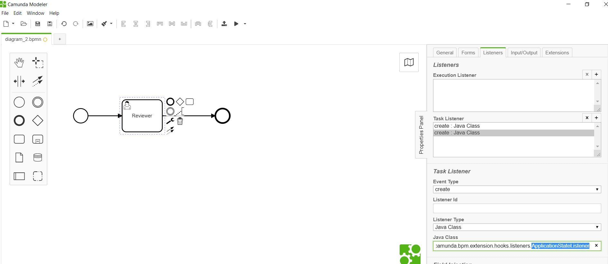

# Application State Listener 

**org.camunda.bpm.extension.hooks.listeners.ApplicationStateListener**

This component can be used on any event of task/execution listener.  Upon configuration it takes care of
1. Syncing formsflow.ai system' with the active status from camunda. 
2. Send value from cam variables: "applicationStatus" and "formUrl" to formsflow.ai system for capturing audit.

## Table of Content
* [Type](#type)
* [How it Works](#how-it-works)
* [How to Use](#how-to-use)

## Type

Task/Execution Listener

### How it Works

This invokes listed REST endpoints in sequence,
1. Invokes REST endpoint of application **application/{id}** with data from cam variable "applicationStatus".
2. Invokes REST endpoint of application history **application/{id}/history**  with data from cam variables: "applicationStatus" and "formUrl".

The component is dependent on listed variables from camunda context,
1. applicationId 
2. applicationStatus
3. formUrl

### How to Use

Below snapshot shows how to configure the **ApplicationStateListener** to a task. 

   
