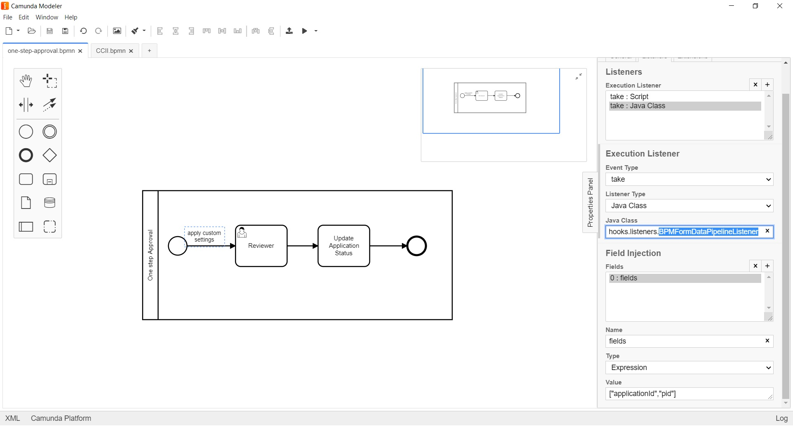

# BPM Form Data Pipeline Listener 

**org.camunda.bpm.extension.hooks.listeners.task.BPMFormDataPipelineListener**

This component can be used on any event of task/execution listener.  Upon configuration, it copies camunda variables to form (formio) data.

## Table of Content
* [Type](#type)
* [How it Works](#how-it-works)
* [How to Use](#how-to-use)

## Type

Task/Execution Listener

### How it Works

This component from CAM variables prepares the data for formio submission and, invokes the **formio Rest based submission endpoint** for updates.

### How to Use
This component relies on listed parameters.
* fields (Listener field of type expression). Takes in cam variables as array. For example. ["pid","applicationId","task_id"]. It would populate data from cam variables to form. `Mandatory = Yes`

Below snapshot shows how to configure the **BPMFormDataPipelineListener** to an execution. 

