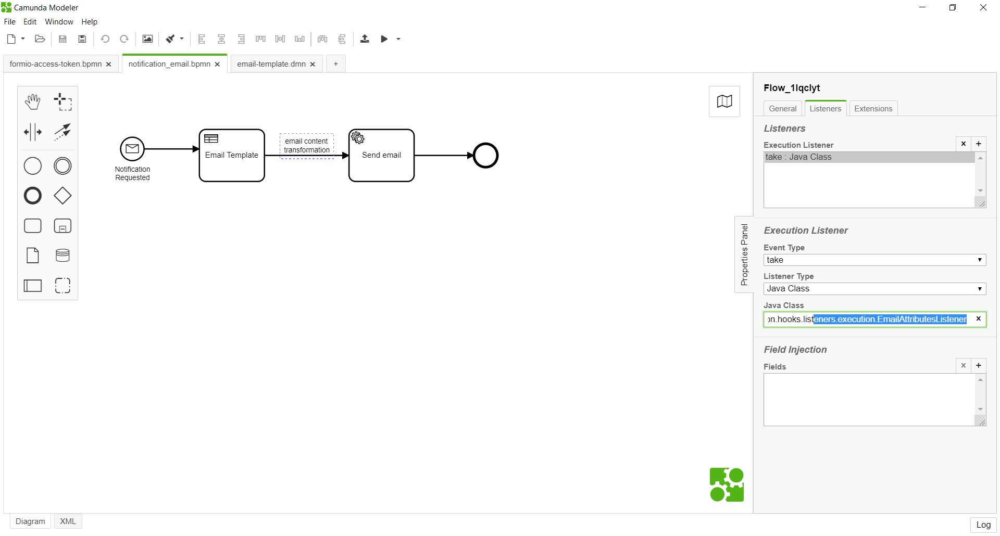

# Email Attributes Listener 

**org.camunda.bpm.extension.hooks.listeners.execution.EmailAttributesListener**

This component intended to run **ONLY** with the process **notification_email.bpmn** & "email-template.dmn" or any similar notification processes.
It replaces all reserved identifier **@{variable}** with values in email body.

## Table of Content
* [Type](#type)
* [How it Works](#how-it-works)
* [How to Use](#how-to-use)

## Type

Execution Listener

### How it Works

The listener is configured on the navigation path between email-template.dmn and email connector.
On execution, the email body output from the DMN is transformed with values.

### How to Use

Below snapshot shows how **EmailAttributesListener** is used in process **notification_email.bpmn**

