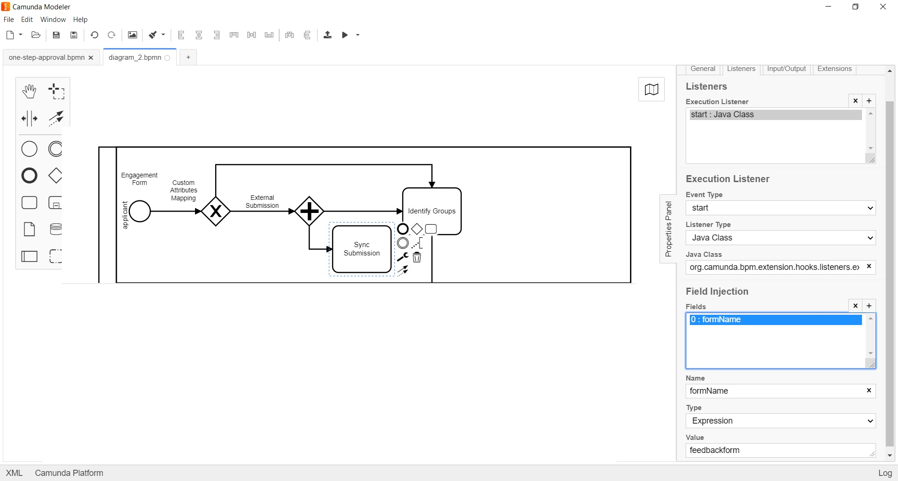

# External Submission Listener 

**org.camunda.bpm.extension.hooks.listeners.execution.ExternalSubmissionListener**

This component can be used on the navigation path of start.  
This allows direct integration from any external system and does offline sync-up within formsflow.ai i.e creates submission in formio.

## Table of Content
* [Type](#type)
* [How it Works](#how-it-works)
* [How to Use](#how-to-use)

## Type

Execution Listener

### How it Works

This component relies on listed parameters.
* formName (Listener field) : Should be the form name from formio. `Mandatory = Yes`; to which the data has to be submitted offline.

### How to Use

Below snapshot shows how to configure the **ExternalSubmissionListener** to an execution.

