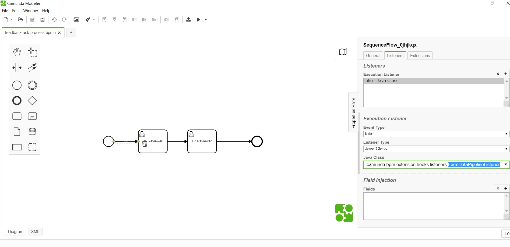

# Form BPM Data Pipeline Listener 

**org.camunda.bpm.extension.hooks.listeners.task.FormBPMDataPipelineListener**

This component can be used on any event of task/execution listener.  Upon configuration, it copies data from form (formio) to camunda variables.

## Table of Content
* [Type](#type)
* [How it Works](#how-it-works)
* [How to Use](#how-to-use)

## Type

Task/Execution Listener

### How it Works

This component invokes the **formio Rest based submission endpoint** to read data; and create or update camunda variables.

### How to Use

Below snapshot shows how to configure the **FormDataPipelineListener** to an execution. 

