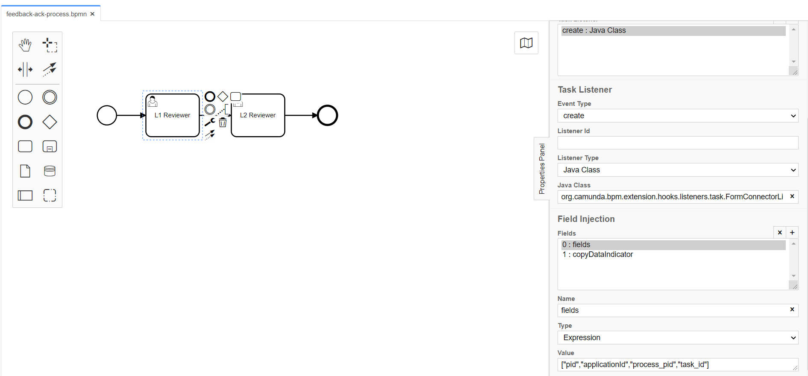
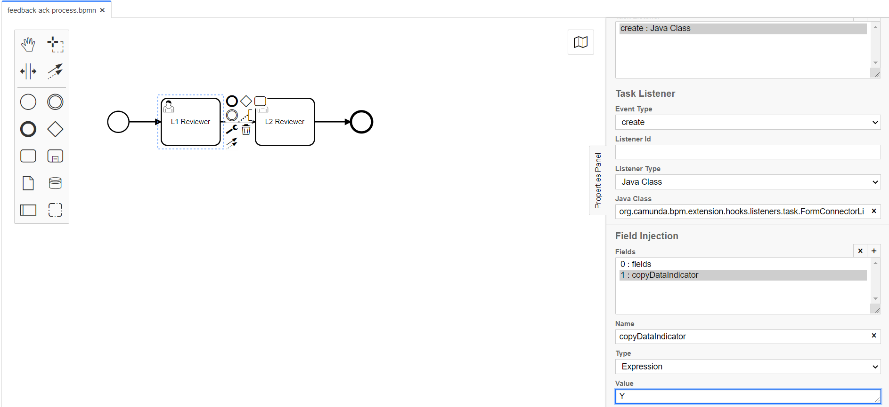

# Form Connector Listener 

**org.camunda.bpm.extension.hooks.listeners.task.FormConnectorListener**

This component can be used on **CREATE** event of task listener.  This serves to associate a form with task.
Please note that, this is required only when there is a need to switch to a new form as part of the navigation from the initial submitted form.

## Table of Content
* [Type](#type)
* [How it Works](#how-it-works)
* [How to Use](#how-to-use)

## Type

Task Listener

### How it Works

This component relies on listed parameters.
* formName (Extension Property) : Should be the form name from formio. `Mandatory = Yes`
* copyDataIndicator (Listener field of type expression). Possible Values: Y or N. Setting this value to "Y" will propagate all matching field values from existing formUrl to new form. 
* fields (Listener field of type expression). Takes in cam variables as array. For example. ["pid","applicationId","task_id"]. It would populate data from cam variables to form. `Mandatory = Yes` 
Note: pid is process instance id, task_id is task Id and applicationId is applicationId. It is important for forms associated with task to know about these.
### How to Use

Below snapshot shows how to configure the **FormConnectorListener** to a task. 

##### FormConnectorListener being configured on create of task; with fields configured to populate task details into form' metadata fields.

##### Shows the configuration of optional copyDataIndicator been configured to copying data from existing submission to new one.

   
