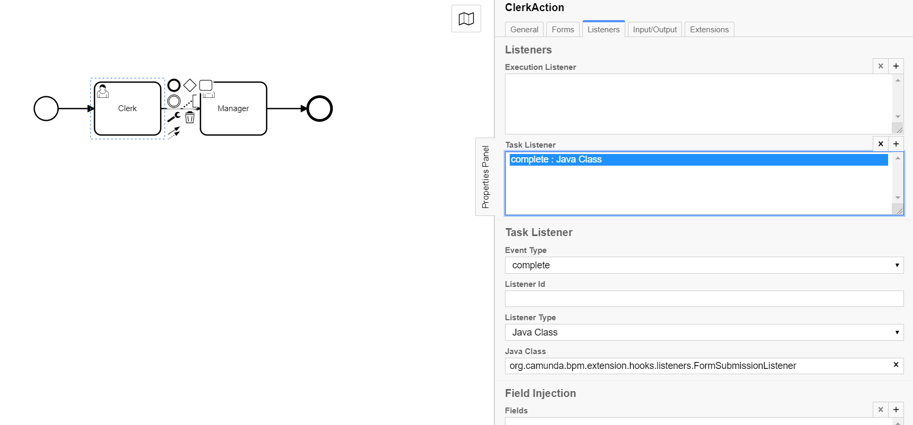

# Form Submission Listener 

**org.camunda.bpm.extension.hooks.listeners.FormSubmissionListener**

This component can be used on any event of task/execution listener.  Upon configuration, it creates a new submission from the current submission.

## Table of Content
* [Type](#type)
* [How it Works](#how-it-works)
* [How to Use](#how-to-use)

## Type

Task/Execution Listener

### How it Works

This component from the current formUrl create a new revision and set that as a CAM variable.

* [STEP 1] - Create a new submissionId using the existing form data.
* [STEP 2] - Set the new formUrl with CAM variables

The component is dependent on listed variables from camunda context,
1. formUrl

### How to Use

Below snapshot shows how to configure the **FormSubmissionListener** to a task. 

