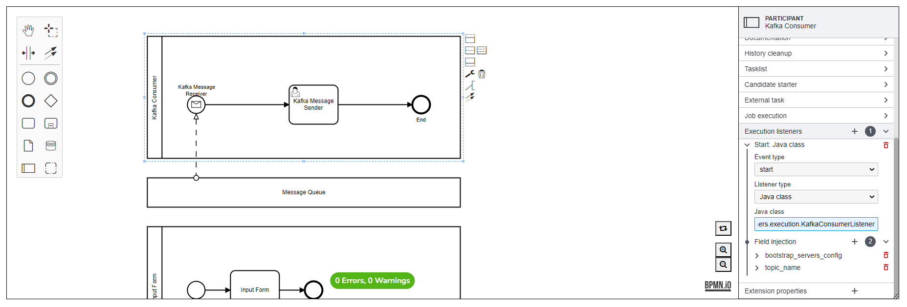
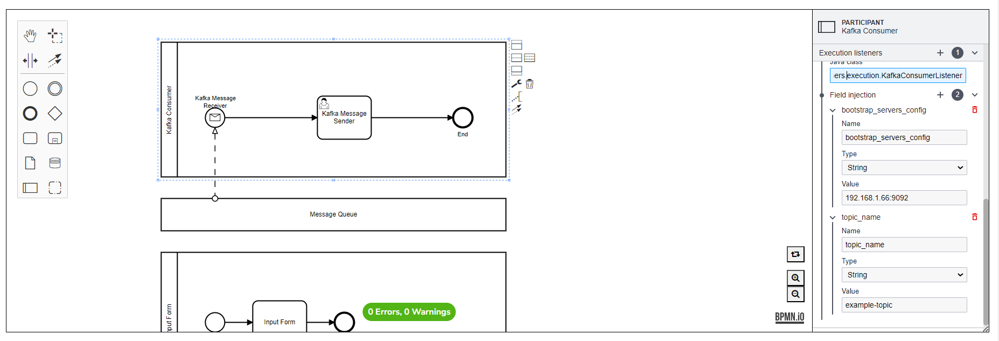
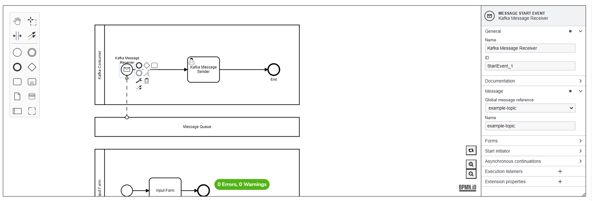

# Kafka Consumer Listener 

**org.camunda.bpm.extension.hooks.listeners.execution.KafkaConsumerListener**

This component can be used on any event of execution listener.  Upon configuration, it will start listening or consuming messages from a Kafka topic.  It is recommended to configure this on an event that will be triggered early such as Process Start Event.

## Table of Content
* [Type](#type)
* [How it Works](#how-it-works)
* [How to Use](#how-to-use)

## Type

Execution Listener

### How it Works

This component reads the field injection properties and based on the property values, it will start listening or consuming messages from a Kafka topic.

This component relies on listed parameters. 

a. bootstrap_servers_config [Mandatory = Yes]  
b. topic_name [Mandatory = Yes]  

- bootstrap_servers_config (Field Injection of type expression or String): A list of host/port pairs to use for establishing the initial connection to the Kafka cluster..
- topic_name (Field Injection of type expression or String): Topic name where the message key-value pair will be consumed.

Once a message is consumed, a message will be correlated using the topic name and the kafka message will be sent as a process variable.  If the kafka message has no key, a default key ("messageKey") will be assigned to avoid error.  What this mean is that you just need to create a Message Event (example: Message Start Event) and set the kafka topic name as the "global message reference" if you want to receive the kafka message that is being consumed.  You can get the kafka message as a process variable where the key is the kafka message key (or "messageKey" if it was sent to kafka with no key).  Check out the screenshots below.

Below are the other non-mandatory parameters.  Kindly refer to github source code of **org.apache.kafka.clients.CommonClientConfigs** and **org.apache.kafka.clients.consumer.ConsumerConfig** for more detailed explanation of each parameters:

- group_id_config [Mandatory = No]
- key_deserializer_class_config [Mandatory = No]
- value_deserializer_class_config [Mandatory = No]
- group_instance_id_config [Mandatory = No]
- max_poll_records_config [Mandatory = No]
- max_poll_interval_ms_config [Mandatory = No]
- session_timeout_ms_config [Mandatory = No]
- heartbeat_interval_ms_config [Mandatory = No]
- client_dns_lookup_config [Mandatory = No]
- enable_auto_commit_config [Mandatory = No]
- auto_commit_interval_ms_config [Mandatory = No]
- partition_assigment_strategy_config [Mandatory = No]
- auto_offset_reset_config [Mandatory = No]
- fetch_min_bytes_config [Mandatory = No]
- fetch_max_bytes_config [Mandatory = No]
- fetch_max_wait_ms_config [Mandatory = No]
- metadata_max_age_config [Mandatory = No]
- max_partition_fetch_bytes [Mandatory = No]
- send_buffer_config [Mandatory = No]
- receive_buffer_config [Mandatory = No]
- client_id_config [Mandatory = No]
- client_rack_config [Mandatory = No]
- reconnect_backoff_ms_config [Mandatory = No]
- reconnect_backoff_max_ms_config [Mandatory = No]
- retry_backoff_ms_config [Mandatory = No]
- metrics_sample_window_ms_config [Mandatory = No]
- metrics_num_samples_config [Mandatory = No]
- metrics_recording_level_config [Mandatory = No]
- metric_reporter_classes_config [Mandatory = No]
- check_crcs_config [Mandatory = No]
- socket_connection_setup_timeout_ms_config [Mandatory = No]
- socket_connection_setup_timeout_max_ms_config [Mandatory = No]
- connections_max_idle_ms_config [Mandatory = No]
- request_timeout_ms_config [Mandatory = No]
- default_api_timeout_ms_config [Mandatory = No]
- interceptor_classes_config [Mandatory = No]
- exclude_internal_topics_config [Mandatory = No]
- isolation_level_config [Mandatory = No]
- default_isolation_level [Mandatory = No]
- allow_auto_create_topics_config [Mandatory = No]
- security_providers_config [Mandatory = No]

### How to Use

Below snapshot shows how to configure the **KafkaConsumerListener** to an execution. 

* [STEP 1]  Setup the KafkaConsumerListener as Execution Listener in a Process Start Event

* [STEP 2] Setup a Message Event that will receive the kafka message.  The "Global message reference" should be equivalent to the kafka topic name being listened to.

* [STEP 3] The kafka message can be accessed downstream from the process variable.  Example, a kafka message without key can be accessed from an expression using: ${execution.getVariable('messageKey')}

