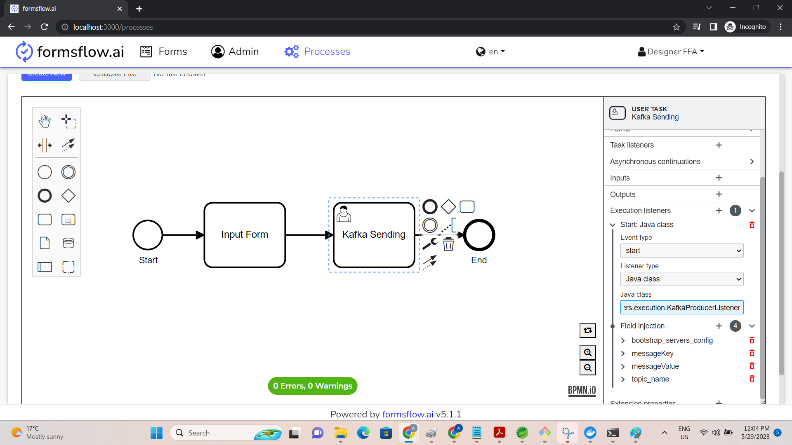

# Kafka Producer Listener 

**org.camunda.bpm.extension.hooks.listeners.execution.KafkaProducerListener**

This component can be used on any event of execution listener.  Upon configuration, it will send message to Kafka bootstrap server.

## Table of Content
* [Type](#type)
* [How it Works](#how-it-works)
* [How to Use](#how-to-use)

## Type

Execution Listener

### How it Works

This component reads the field injection properties and sends kafka message based on the property values.

This component relies on listed parameters. 

a. bootstrap_servers_config [Mandatory = Yes]  
b. messageKey [Mandatory = Yes]  
c. messageValue [Mandatory = Yes]  
d. topic_name [Mandatory = Yes]  

- bootstrap_servers_config (Field Injection of type expression or String): A list of host/port pairs to use for establishing the initial connection to the Kafka cluster..
- messageKey (Field Injection of type expression or String): Message key.  
- messageValue (Field Injection of type expression or String): Message value.   
- topic_name (Field Injection of type expression or String): Topic name where the message key-value pair will be sent.

Below are the other non-mandatory parameters.  Kindly refer to github source code of **org.apache.kafka.clients.CommonClientConfigs** and **org.apache.kafka.clients.producer.ProducerConfig** for more detailed explanation of each parameters:

- key_serializer_class_config [Mandatory = No]
- value_serializer_class_config [Mandatory = No]
- client_dns_lookup_config [Mandatory = No]
- metadata_max_age_config [Mandatory = No]
- metadata_max_idle_config [Mandatory = No]
- batch_size_config [Mandatory = No]
- partitioner_adaptive_partitioning_enable_config [Mandatory = No]
- partitioner_availability_timeout_ms_config [Mandatory = No]
- partitioner_ignore_keys_config [Mandatory = No]
- acks_config [Mandatory = No]
- linger_ms_config [Mandatory = No]
- request_timeout_ms_config [Mandatory = No]
- delivery_timeout_ms_config [Mandatory = No]
- client_id_config [Mandatory = No]
- send_buffer_config [Mandatory = No]
- receive_buffer_config [Mandatory = No]
- max_request_size_config [Mandatory = No]
- reconnect_backoff_ms_config [Mandatory = No]
- reconnect_backoff_max_ms_config [Mandatory = No]
- max_block_ms_config [Mandatory = No]
- buffer_memory_config [Mandatory = No]
- retry_backoff_ms_config [Mandatory = No]
- compression_type_config [Mandatory = No]
- metrics_sample_window_ms_config [Mandatory = No]
- metrics_num_samples_config [Mandatory = No]
- metrics_recording_level_config [Mandatory = No]
- metric_reporter_classes_config [Mandatory = No]
- max_in_flight_requests_per_connection[Mandatory = No]
- retries_config [Mandatory = No]
- socket_connection_setup_timeout_ms_config [Mandatory = No]
- socket_connection_setup_timeout_max_ms_config [Mandatory = No]
- connections_max_idle_ms_config [Mandatory = No]
- partitioner_class_config [Mandatory = No]
- interceptor_classes_config [Mandatory = No]
- enable_idempotence_config [Mandatory = No]
- transaction_timeout_config [Mandatory = No]
- transactional_id_config [Mandatory = No]
- security_providers_config [Mandatory = No]

### How to Use

Below snapshot shows how to configure the **KafkaProducerListener** to an execution. 

