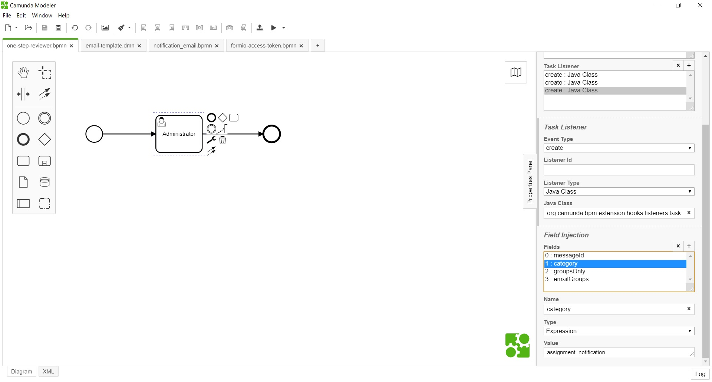

# Notify Listener 

**org.camunda.bpm.extension.hooks.listeners.task.NotifyListener**

This component can be used on **CREATE** event of task listener; and sends email upon task creation.
 It sends email to members of candidate's group and to members of **emailGroups** (Optional) .
## Table of Content
* [Type](#type)
* [How it Works](#how-it-works)
* [How to Use](#how-to-use)

## Type

Task Listener

### How it Works

This component relies on listed parameters.
a. messageId [Mandatory = Yes]  
b. category [Mandatory = Yes]  
c. groupsOnly [Mandatory = Yes]  
c. emailGroups [Mandatory = Yes]  

- messageId (Listener field of type expression): This maps to the any process event.
- category (Listener field of type expression): This maps to the email template DMN category.  
- groupsOnly (Listener field of type expression): This flags that the email to be sent only to **emailGroups**.   
- emailGroups (Listener field of type expression): Takes in email group names as array. For example. ["ADMO","ED-Operations"].

### How to Use

Below snapshot shows how to configure the **NotifyListener** to a task. 

##### FormConnectorListener being configured on create of task; with message event details. 

##### Below snapshot shows configuration of optional parameter (additionalEmailGroups).

