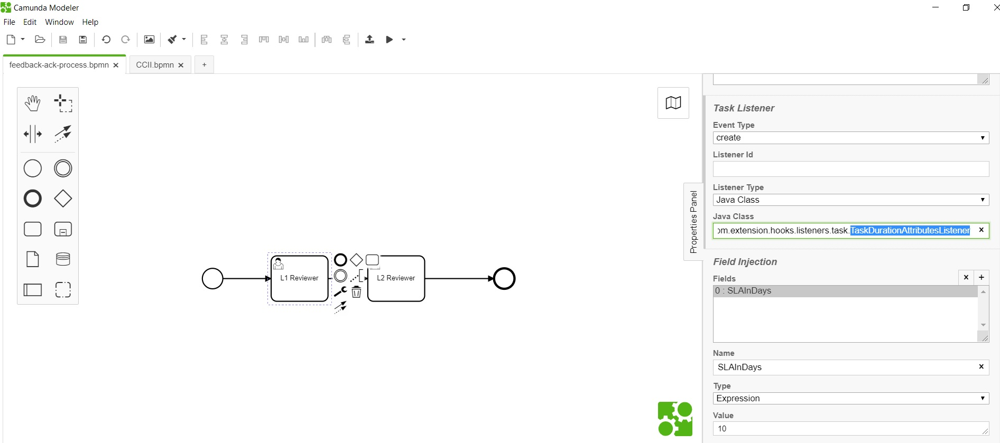

# Form Duration Attributes Listener 

**org.camunda.bpm.extension.hooks.listeners.task.TaskDurationAttributesListener**

This component can be used on **CREATE** event of task listener. This calculates and set DUE DATE in business days only.

## Table of Content
* [Type](#type)
* [How it Works](#how-it-works)
* [How to Use](#how-to-use)

## Type

Task Listener

### How it Works

- This takes in a mandatory expression field **SLAInDays**. It calculate due date by adding SLAInDays value with task creation date.
Please note; this also creates a CAM variable **task_due_date** with the calculated value.

### How to Use

Below snapshot shows how to configure the **TaskDurationAttributesListener** to a task. 

