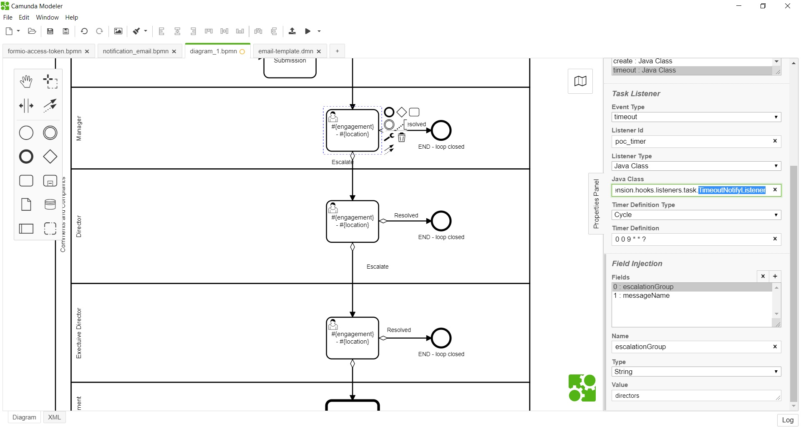
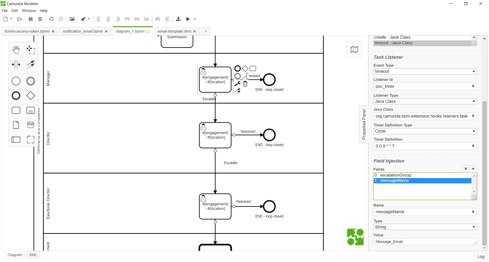

# Timeout Notification Listener 

**org.camunda.bpm.extension.hooks.listeners.task.TimeoutNotifyListener**

This component sends an email reminder a day before task due date, and escalation email on the day after due date.

## Table of Content
* [Type](#type)
* [How it Works](#how-it-works)
* [How to Use](#how-to-use)

## Type

Task Listener

### How it Works

This component intended to use only along with task due date.

This component relies on listed parameters.
*  **escalationGroup** (Listener Field) : Recognized groupName within Camunda. `Mandatory = Yes`  
*  **messageName** (Listener Field) : This refers the message name from **notification_email.bpmn** . `Mandatory = Yes`  
  
The listener is expected to be configured on task event **timeout** with any desired timer definition.  
Upon configuration, For reminder: a day before due date;email is sent.    
    > For assigned tasks; reminder is sent to user.  
    >  For unassigned tasks; reminder is sent to group.  
Also, for escalation: a day after due date; email is sent.  
    > For both assigned and unassigned task, it uses the configured **escalationGroup**.   

Please note this component uses the process **notification_email.bpmn** and, it will recognise only the reserved category **activity_reminder** and **activity_escalation**.

    
### How to Use

Below snapshot shows how **TimeoutNotifyListener** can be used in process.

##### TimeoutNotifyListener being configured on timeout of task; with fields configured for notification.

