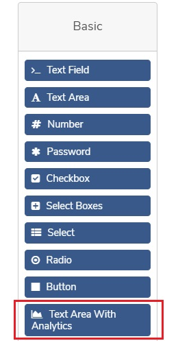
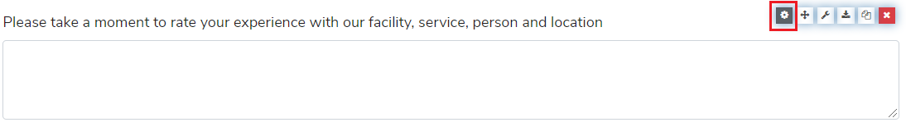
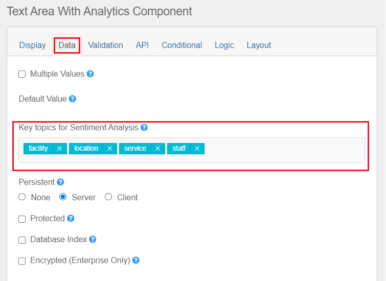

## Text area with analytics component

This custom component is used in formsflow.ai to supports the designer to enable
fields for Natural language processing based on sentiment analysis. To use
the custom component in **formsflow.ai** follow the below steps:

- Login with the designer role
- Choose a new/existing form and click the edit forms button
- Drag and drop **Text Area with Analytics** component from the Basic section in left panel

- Choose the **settings icon** of Text Area with Analytics component and go to 
section Data

- Add the **Key topics for Sentiment Analysis** like facility, service, etc.

- Click the save button.
