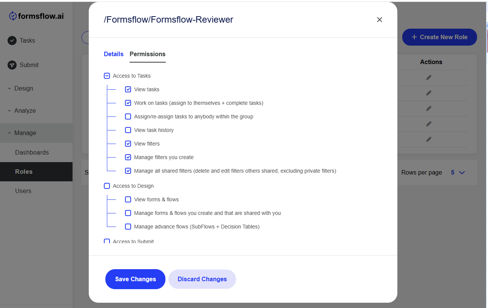

### Setup

#### 1. Create a virtual environment

##### For macOS/Linux:
```bash
python3 -m venv venv
```

##### For Windows:
```powershell
python -m venv venv
```

#### 2. Activate the virtual environment

##### For macOS/Linux:
```bash
source venv/bin/activate
```

##### For Windows:
```powershell
.\venv\Scripts\activate
```

#### 3. Install requirements
```bash
pip install -r requirements.txt
```

#### 4. Add environment variables

##### For macOS/Linux:
```bash
export KEYCLOAK_BASE_URL=<keycloak-base-url>
export REALM=<formsflow-realm>
export CLIENT_ID=<forms-flow-bpm or keycloak client id with client_credentials grant>
export CLIENT_SECRET=<keycloak client secret>
```

##### For Windows (CMD):
```cmd
export KEYCLOAK_BASE_URL=<keycloak-base-url>
export REALM=<formsflow-realm>
export CLIENT_ID=<forms-flow-bpm or keycloak client id with client_credentials grant>
export CLIENT_SECRET=<keycloak client secret>
```

##### For Windows (PowerShell):
```powershell
export KEYCLOAK_BASE_URL=<keycloak-base-url>
export REALM=<formsflow-realm>
export CLIENT_ID=<forms-flow-bpm or keycloak client id with client_credentials grant>
export CLIENT_SECRET=<keycloak client secret>
```

### Migration
#### 7.0.0
```commandline
PS : The keycloak client provided for this script needs `manage-clients` role from `realm-management`.
```
In v7.0.0, permission matrix has been introduced, so existing groups needs new client roles. Run the following command to migrate the groups:
```bash
[Default setup]
python migrate-7.0.0.py
```

```bash
[Multitenant setup]
python migrate-7.0.0.py --multitenant=True --tenants=tenant1,tenant2
```
#### 7.1.0
```commandline
PS : The keycloak client provided for this script needs `manage-clients` role from `realm-management`.
Note: If you're upgrading from a version prior to 7.0.0, execute python migrate-7.0.0.py before proceeding.
```
v7.1.0, introduces new roles, removes deprecated ones, and updates role descriptions in the permission matrix.
After completing the [setup](#setup), run the following command to apply these migration changes:
```bash
[Default setup]
python migrate-7.1.0.py
```
#### 7.2.0
```commandline
PS : The keycloak client provided for this script needs `manage-clients` role from `realm-management`.
Note: If you're upgrading from version 7.0.0 to 7.2.0 execute python migrate-7.1.0.py before proceeding.
```
To migrate new roles introduced in v7.1.0 to the existing groups. Run the following command
```bash
[Default setup]
python migrate-7.2.0.py
```

```bash
[Multitenant setup]
python migrate-7.2.0.py --multitenant=True --tenants=tenant1,tenant2
```

##### Note:
* To add these permissions(roles) to the specific group.

    * Login to formsflow.ai --> Manage --> Roles --> Actions --> Edit --> Permissions 

<br/>
