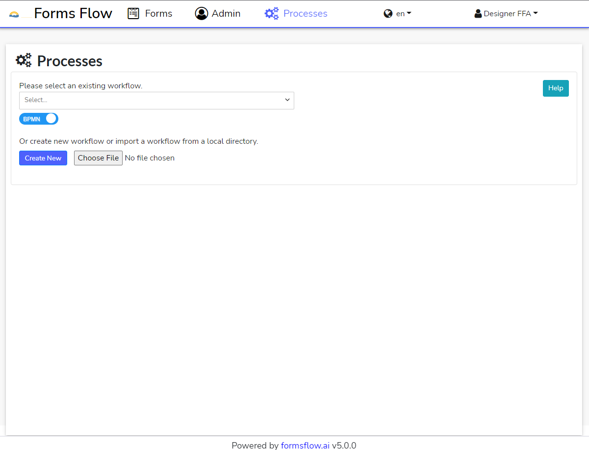
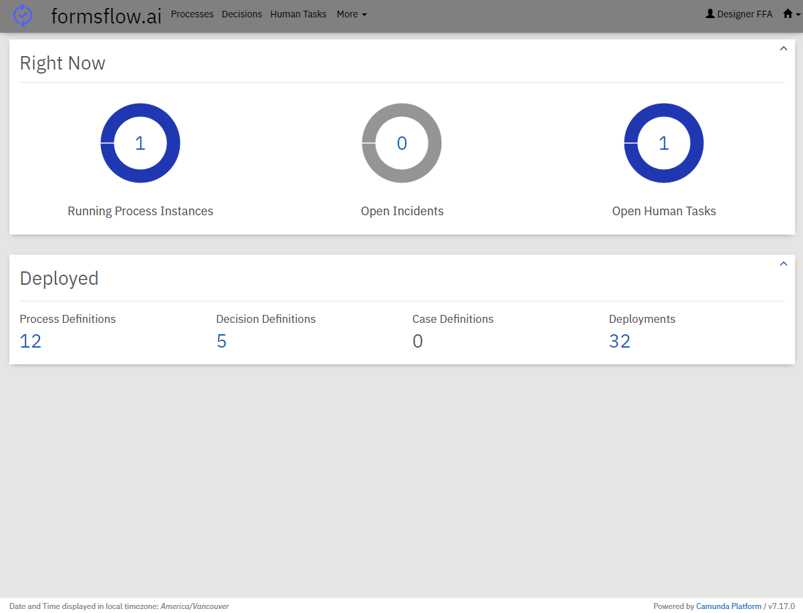
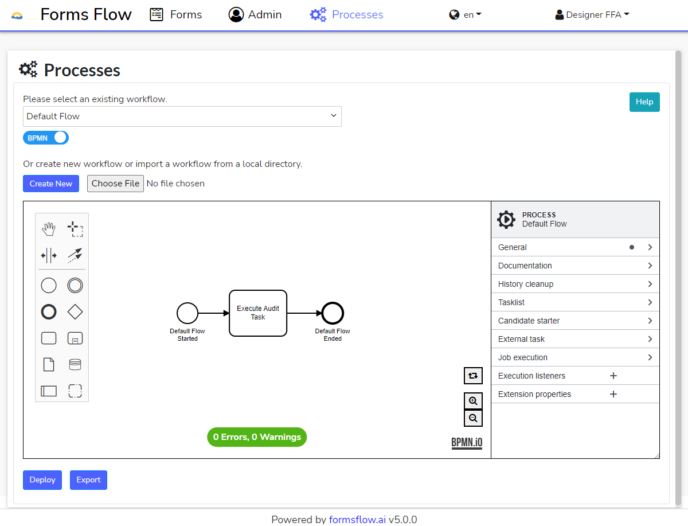
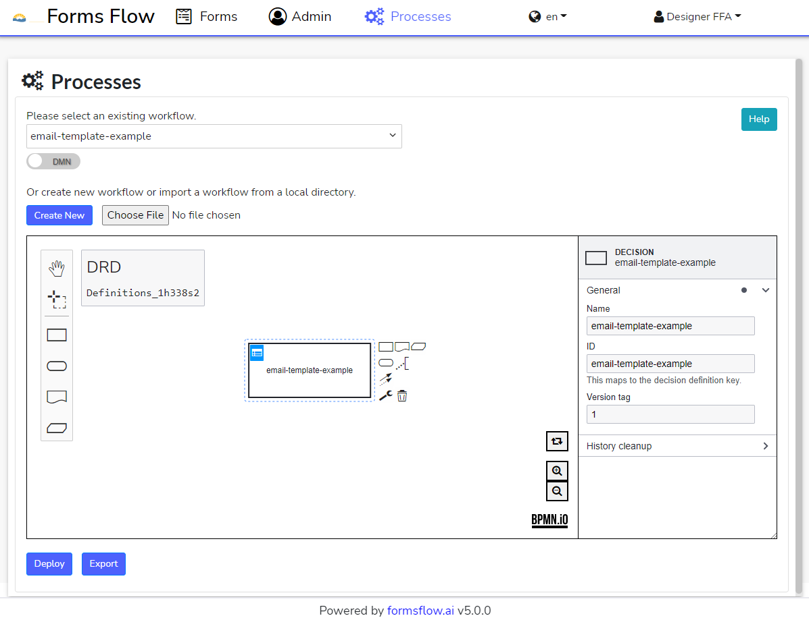
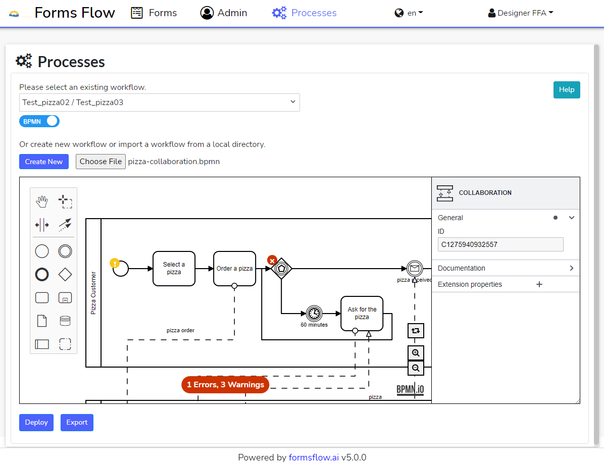

# Workflow Modeler

**formsflow.ai** leverages Camunda for workflow and decision automation. The application integrates [BPMN.io](https://www.https://bpmn.io/) libraries to view, create, edit, import, export, and deploy Business Process Model and Notation (BPMN) and Decision Model and Notation (DMN) models.

The Workflow Modeler eliminates the need to use the Camunda Modeler stand-alone application to develop and deploy workflows.

## Table of Contents

1. [How to model workflows](#how-to-model-workflows)
2. [Usage](#usage)
   - [Select](#select)
   - [Canvas](#canvas)
   - [Create New](#create-new)
   - [Import](#import)
   - [Deploy](#deploy)
     - [Multi-tenancy](#multi-tenancy)
   - [Export](#export)
3. [Features](#features)
   - [BPMN Linter](#bpmn-linter)
     - [BPMN Linter Rules](#bpmn-linter-rules)
   - [Properties Panel](#properties-panel)
4. [Naming Convention](#naming-convention)

## How to model workflows

BPMN: https://camunda.com/bpmn/
DMN: https://camunda.com/dmn/

## Usage

To get started with the BPMN / DMN Modeler you will need to access the **formsflow.ai** application with [Designer](../../../../forms-flow-idm/keycloak/README.md#formsflow-ai-user-credentials) privileges then select the 'Processes' tab from the Navigation bar.

### Select

Executable BPMN Process Definitions and DMN Decision Definitions that have been been deployed to Camunda are loaded into the 'Please select an existing workflow' dropdown. Process Definitions are loaded by default but Decision Definitions can be toggled by clicking the blue BPMN toggle button.

Process Definitions and Decision Definitions can be found at the associated [forms-flow-bpm](../../../../forms-flow-bpm) instance at http://localhost:8000/camunda/app/cockpit/default/#/dashboard.

Each list of definitions are called using the [Camunda 7 REST API](https://docs.camunda.org/manual/7.17/reference/rest/). Process Definitions are called using the GET /process-definition endpoint and Decision Definitions are called using GET /decision-definition.

NOTE: For definition keys with multiple deployments or versions, only the latest version of each definition is included.

### Canvas

Once a definition is selected then the modeler is rendered and the model of the selected definition is displayed in the canvas.

The canvas has multiple features including a BPMN Linter, properties panel, tool bar, and zoom capabilities.

### Create New

Click the 'Create New' button below the dropdown to create a new Process or Decision Definition.

### Import

Click the 'Choose File' button below the dropdown to import files with either .bpmn or .dmn extensions. The toggle button will automatically toggle to the correct model and the file will be loaded into the canvas.

### Deploy

REST service **/camunda/engine-rest-ext/deployment/create** will be used for the deployment of processes and decisions.

#### Multi-tenancy

If multi-tenancy is enabled then a checkbox will appear allowing the user to deploy to all tenants or if unchecked, the model will be deployed to the current tenant.

### Export

Click the 'Export' button below the dropdown to export the model shown in the canvas.

NOTE: the model will be exported even if there are errors shown in the linter or properties panel.

## Features

The Workflow Modeler provides multiple features including a Linter for BPMN models and a properties panel that is integrated with Camunda properties.

### BPMN Linter

The BPMN Linter provided by BPMN.io is used to lint BPMN models. The documentation can be found [here](https://www.npmjs.com/package/bpmn-js-bpmnlint). Linting rules can be modified [here](./lint-rules/packed-config.js). All errors must be resolved before the model can be deployed. The details of each error or warning can be seen when hovering on either a yellow '!' or a red 'x'.

#### BPMN Linter Rules

Documentation for Linter Rules can be found [here](https://github.com/bpmn-io/bpmnlint/tree/master/docs/rules#rules).

### Properties Panel

The properties panel is integrated with Camunda properties. Documentation can be found [here](https://www.npmjs.com/package/bpmn-js-properties-panel).

## Naming Convention

Deployment Name is the same as Process Name or Decision Name in the properties panel. For Deployments with multiple Processes or Decisions, the deployment name is a combination of all names separated by a '/'.

The File Name is the Deployment name with spaces removed and the '/' replaced with a '-'.
